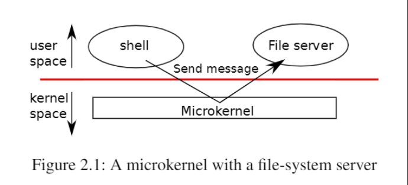
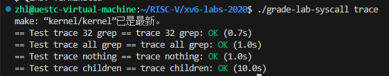

# 操作系统如何实现隔离和防御

操作系统的主要功能就是管理硬件，避免程序直接和硬件进行交互，而是通过内核来操作硬件，例如，使用CPU、读取内存和写入磁盘等操作。操作系统具有两大特性：隔离性（Isolation）和防御性（Defensive）。

* 隔离性主要目的是分离程序和硬件资源，避免程序直接使用硬件资源。如果不进行隔离，无法保证程序之间的切换，且一个程序可能会读写其他程序的内存，导致其他程序无法继续运行下去。隔离性能够很好地保证 cpu 的多路复用（进程切换、cpu 分时使用）和进程之间内存的隔离（虚拟内存，每个进程有自己的内存）。
* 防御性是指，并不是所有的指令进程都可以执行的。操作系统将指令划分了四个等级（R0-R3，其中R0的等级最高，可以执行任何指令），同时划分了两个状态，用户态和内核态。用户态执行的程序的等级较低，可以执行的指令有限；而内核态程序的等级较高，可以执行任何指令。这样可以避免恶意程序的攻击。

系统调用的功能就是用户态的程序需要执行等级更高的指令时，需要先切换到内核态，在内核态执行完后，再切换到用户态。过程如下图所示：



# 任务一、实现System call tracing

创建一个新的 `trace`系统调用来控制跟踪。它应该有一个参数，这个参数是一个整数“掩码”（mask），它的比特位指定要跟踪的系统调用。例如，要跟踪 `fork`系统调用，程序调用 `trace(1 << SYS_fork)`，其中 `SYS_fork`是***kernel/syscall.h***中的系统调用编号。如果在掩码中设置了系统调用的编号，则必须修改xv6内核，以便在每个系统调用即将返回时打印出一行。该行应该包含进程id、系统调用的名称和返回值；

实现思路：

首先了解操作系统中，系统调用的执行过程

1. 用户通过向命令行输入命令，调用用户态下的函数。例如，程序fork()。用户调用后进入跳板入口 usys.S 文件，执行 ecall 汇编指令进入中断处理函数（从用户态进入内核态）。
2. 进入 trampoline.S ，执行 uservec 函数进行用户态线程的保存与内核态现场的恢复然后进入中断处理程序 usertrap()(trap.c)，由于我们这里执行的是 fork() 系统调用所以跳转到 syscall.c 中的 syscall() 函数。（内核态）
3. 在 syscall() 函数中，利用获取从用户空间传入的系统调用号和参数，从系统调用表中找到相应的系统调用并执行。

实现步骤：

1. 将 `$U/_trace` 添加到 Makefile 的 UPROGS 字段中。这样程序才能被编译和链接。
2. 添加声明

   * 在 user/trace.c 文件中，使用了 trace 函数，因此需要在 user/user.h 文件中加入函数声明：`int trace(int);`
   * 同时，为了生成进入中断的汇编文件，需要在 `user/usys.pl` 添加进入内核态的入口函数的声明：`entry("trace");`以便使用 `ecall` 中断指令进入内核态；
   * 同时在 kernel/syscall.h 中添加系统调用号，这样就可以编译成功了。

   说明：

   * 在生成的 user/usys.S 文件中可以看到，汇编语言 `li a7, SYS_trace` 将指令码放到了 a7 寄存器中。在内核态 `kernel/syscall.c` 的 syscall 函数中，使用 `p->trapframe->a7` 取出寄存器中的指令码，然后调用对应的函数。
3. 实现内核中的 sys_trace() 函数

   sys\_trace() 函数，在 kernel/sysproc.c 文件中。目的是实现内核态的 trace() 函数。我们的目的是跟踪程序调用了哪些系统调用函数，因此需要在每个被 trace 的进程中，添加一个 mask 字段，用来识别是否执行了 mask 标记的系统调用。在执行 trace 进程时，如果进程调用了 mask 所包括的系统调用，就打印到标准输出中。内核中 sys_trace() 函数的实现：

   ```
   uint64 sys_trace(void)
   {
   int mask;
   if(argint(0, &mask) < 0) //从用户空间获取掩码 mask
   return -1;
   myproc()->mask = mask;//标记进程
   return 0;
   }
   ```
4. 跟踪子进程

   * 需要跟踪所有 trace 进程下的子进程，在 Kernel/proc.c 中的 fork() 代码中，添加子进程的 mask:np->mask = p->mask;
5. 打印信息

   * 由之前关于系统调用的相关分析知道，所有的系统调用进入内核后都需要经过 syscall() 函数来执行，因此在该函数内添加判断。
   * ```C
     void
     syscall(void)
     {
       int num;
       struct proc *p = myproc();//获取进程控制块

       num = p->trapframe->a7;//从陷阱帧中取出系统调用号
       if(num > 0 && num < NELEM(syscalls) && syscalls[num]) {
         p->trapframe->a0 = syscalls[num]();//把系统调用的返回值放入 a0 寄存器，用于后续判断系统调用号的执行情况
         if ((1 << num) & p->mask) {//判断该进程是否被标记，若被标记则输出相应信息
           printf("%d: syscall %s -> %d\n", p->pid, syscalls_name[num], p->trapframe->a0);
         }
       } else {
         printf("%d %s: unknown sys call %d\n",
                 p->pid, p->name, num);
         p->trapframe->a0 = -1;
       }
     }
     ```

实验结果：


