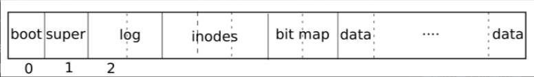
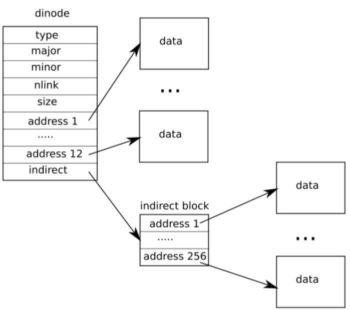
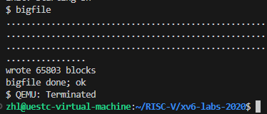
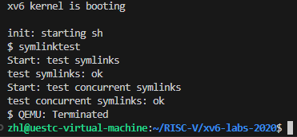

# lab9.file system

## 实验相关

### 文件系统

**xv6 的文件系统和许多其他系统的实现大体是相同的，只不过很多地方简化了很多。存储文件的方式都是以 block 的形式。物理磁盘在读写时，是以扇区为单位的，通常来讲，****每个扇区是 512 个字节**。但操作系统读取磁盘时，由于寻道的时间是很长的，读写数据的时间反而没那么久，因此会操作系统一般会读写连续的多个扇区，所使用的时间几乎一样。操作系统以多个扇区作为一个磁盘块，**xv6是两个扇区，即一个 block 为 1024 个字节。**

**磁盘只是以扇区的形式存储数据，但如果没有一个读取的标准，该磁盘就是一个生磁盘。磁盘需要按照操作系统读写的标准来存储数据，格式如下：**



** 从中可以看到，磁盘中不同区域的数据块有不同的功能。****第 0 块数据块是启动区域，计算机启动就是从这里开始的；第 1 块数据是超级块，存储了整个磁盘的信息；然后是 log 区域，用于故障恢复；bit map 用于标记磁盘块是否使用；然后是 inode 区域 和 data 区域。**

**磁盘中主要存储文件的 block 是 inode 和 data。操作系统中，文件的信息是存放在 inode 中的，每个文件对应了一个 inode，****inode 中含有存放文件内容的磁盘块的索引信息**，用户可以通过这些信息来查找到文件存放在磁盘的哪些块中。inodes 块中存储了很多文件的 inode。

## 任务一、Large files

**xv6中的 inode 有 12个直接索引（直接对应了 data 区域的磁盘块），1个一级索引（存放另一个指向 data 区域的索引）。因此，****最多支持 12 + 256 = 268 个数据块**。如下图所示：



**因为这个设计，xv6 中存储文件的大小受到了限制，因此本实验的第一个任务就是****通过实现二级索引扩大所支持的文件大小**。

### 实现思路

**1.kernel/fs.h 文件中减小 NDIRECT 的值，为二级索引留一个位置：**

```c
#define NDIRECT 11
#define NINDIRECT (BSIZE / sizeof(uint))
#define NDINDIRECT NINDIRECT * NINDIRECT
#define MAXFILE (NDIRECT + NINDIRECT + NDINDIRECT)

// On-disk inode structure
struct dinode {
  short type;           // File type 区分文件、目录和特殊文件
  short major;          // Major device number (T_DEVICE only)
  short minor;          // Minor device number (T_DEVICE only)
  short nlink;          // Number of links to inode in file system 统计引用此inode的目录条目数
  uint size;            // Size of file (bytes)
  uint addrs[NDIRECT+2];   // Data block addresses 数组记录保存文件内容的磁盘块的块号
};
```

**2.上面的是磁盘中的 inode 结构，还需要在 kernel/file.h 中更改内存中的 inode 结构：**

```c
// in-memory copy of an inode
struct inode {
  uint dev;           // Device number
  uint inum;          // Inode number
  int ref;            // Reference count
  struct sleeplock lock; // protects everything below here
  int valid;          // inode has been read from disk?

  short type;         // copy of disk inode
  short major;
  short minor;
  short nlink;
  uint size;
  uint addrs[NDIRECT+2];
};
```

**2.仿照一级索引，写一下二级索引，在 kernel/fs.c 中添加代码：**

```c
static uint
bmap(struct inode *ip, uint bn)
{
  uint addr, *a;
  struct buf *bp;

  if(bn < NDIRECT){
    if((addr = ip->addrs[bn]) == 0)
      ip->addrs[bn] = addr = balloc(ip->dev);
    return addr;
  }
  bn -= NDIRECT;

  if(bn < NINDIRECT){
    // Load indirect block, allocating if necessary.
    if((addr = ip->addrs[NDIRECT]) == 0)
      ip->addrs[NDIRECT] = addr = balloc(ip->dev);
    bp = bread(ip->dev, addr);
    a = (uint*)bp->data;
    if((addr = a[bn]) == 0){
      a[bn] = addr = balloc(ip->dev);
      log_write(bp);
    }
    brelse(bp);
    return addr;
  }
  // 二级索引
  bn -= NINDIRECT;
  if(bn < NDINDIRECT) {
    if((addr = ip->addrs[NDIRECT+1]) == 0)
      ip->addrs[NDIRECT+1] = addr = balloc(ip->dev);
    // 通过一级索引，找到下一级索引
    bp = bread(ip->dev, addr);
    a = (uint*)bp->data;
    if((addr = a[bn/NINDIRECT]) == 0) {
      a[bn/NINDIRECT] = addr = balloc(ip->dev);
      log_write(bp);
    }
    brelse(bp);
    // 重复上面的代码，实现二级索引
    bp = bread(ip->dev, addr);
    a = (uint*)bp->data;
    if ((addr = a[bn%NINDIRECT]) == 0) {
      a[bn%NINDIRECT] = addr = balloc(ip->dev);
      log_write(bp);
    }
    brelse(bp);
    return addr;
  }

  panic("bmap: out of range");
}
```

**3.在 kernel/fs.c 中，添加第二级索引的释放操作：**

```c
void
itrunc(struct inode *ip)
{
  ...
  if(ip->addrs[NDIRECT+1]) {
    bp = bread(ip->dev, ip->addrs[NDIRECT+1]);
    a = (uint*)bp->data;
    for(j = 0; j < NINDIRECT; j++) {//进入第一级
      if(a[j]) {
        bp2 = bread(ip->dev, a[j]);
        a2 = (uint*)bp2->data;
        for(i = 0; i < NINDIRECT; i++) {//进入第二级
          if(a2[i]) bfree(ip->dev, a2[i]);
        }
        brelse(bp2);
        bfree(ip->dev, a[j]);
        a[j] = 0;
      }
    }
    brelse(bp);
    bfree(ip->dev, ip->addrs[NDIRECT+1]);
    ip->addrs[NDIRECT] = 0;
  }
  ip->size = 0;
  iupdate(ip);
}
```

### 实现结果



## 任务二、Symbolic links

**硬链接是指多个文件名指向同一个inode号码。有以下特点：**

* **可以用不同的文件名访问同样的内容；**
* **对文件内容进行修改，会影响到所有文件名；**
* **删除一个文件名****，**不影响另一个文件名的访问。

**而软链接也是一个文件，但是****文件内容指向另一个文件的 inode**。打开这个文件时，会自动打开它指向的文件，类似于 windows 系统的快捷方式。

**xv6 中没有符号链接（软链接），这个任务需要我们实现一个符号链接。**

### 实现思路

1. **配置系统调用的常规操作，如在**`user/usys.pl`、`user/user.h`中添加一个条目，在`kernel/syscall.c`、`kernel/syscall.h`中添加相关内容
2. **添加提示中的相关定义，**`T_SYMLINK`以及`O_NOFOLLOW`

```c
// fcntl.h
#define O_NOFOLLOW 0x004
// stat.h
#define T_SYMLINK 4
```

3. **在**`kernel/sysfile.c`中实现`sys_symlink`，这里需要注意的是`create`返回已加锁的inode，此外`iunlockput`既对`inode`解锁，还将其引用计数减1，计数为0时回收此`inode`。
   **先从寄存器中读取参数，然后开启事务，避免提交出错；为这个符号链接新建一个 inode；在符号链接的 data 中写入被链接的文件；最后，提交事务：**

```c
uint64
sys_symlink(void) {
  char target[MAXPATH], path[MAXPATH];
  struct inode* ip_path;

  if(argstr(0, target, MAXPATH) < 0 || argstr(1, path, MAXPATH) < 0) {
    return -1;
  }

  begin_op();
  // 分配一个inode结点，create返回锁定的inode
  ip_path = create(path, T_SYMLINK, 0, 0);
  if(ip_path == 0) {
    end_op();
    return -1;
  }
  // 向inode数据块中写入target路径
  if(writei(ip_path, 0, (uint64)target, 0, MAXPATH) < MAXPATH) {
    iunlockput(ip_path);
    end_op();
    return -1;
  }

  iunlockput(ip_path);
  end_op();
  return 0;
}
```

4. **修改**`sys_open`支持打开符号链接

**在打开文件时，如果遇到符号链接，直接打开对应的文件。这里为了避免符号链接彼此之间互相链接，导致死循环，设置了一个访问深度（我设成了 10），如果到达该访问次数，则说明打开文件失败。每次先读取对应的 inode，根据其中的文件名称找到对应的 inode，然后继续判断该 inode 是否为符号链接：**

```c
uint64
sys_open(void)
{
  ...

  if(ip->type == T_DEVICE && (ip->major < 0 || ip->major >= NDEV)){
    ...
  }

    // 处理符号链接
  if(ip->type == T_SYMLINK && !(omode & O_NOFOLLOW)) {
    // 若符号链接指向的仍然是符号链接，则递归的跟随它
    // 直到找到真正指向的文件
    // 但深度不能超过MAX_SYMLINK_DEPTH 10
    for(int i = 0; i < 10; ++i) {
      // 读出符号链接指向的路径
      if(readi(ip, 0, (uint64)path, 0, MAXPATH) != MAXPATH) {
        iunlockput(ip);
        end_op();
        return -1;
      }
      iunlockput(ip);
      ip = namei(path);
      if(ip == 0) {
        end_op();
        return -1;
      }
      ilock(ip);
      if(ip->type != T_SYMLINK)
        break;
    }
    // 超过最大允许深度后仍然为符号链接，则返回错误
    if(ip->type == T_SYMLINK) {
      iunlockput(ip);
      end_op();
      return -1;
    }
  }

  if((f = filealloc()) == 0 || (fd = fdalloc(f)) < 0){
    ...
  }
  ...
  return fd;
}
```

### 实现结果


