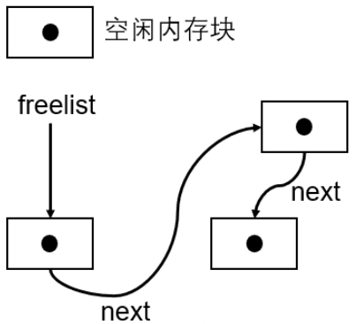
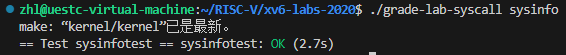

# lab2.syscall

操作系统的主要功能就是管理硬件，程序不是直接和硬件进行交互，而是通过内核来操作硬件，例如，使用CPU、读取内存和写入磁盘等操作。操作系统具有两大特性：隔离性（Isolation）和防御性（Defensive）。

* 隔离性主要目的是分离程序和硬件资源，避免程序直接使用硬件资源。如果不进行隔离，无法保证程序之间的切换，且一个程序可能会读写其他程序的内存，导致其他程序无法继续运行下去。隔离性能够很好地保证 cpu 的多路复用（进程切换、cpu 分时使用）和进程之间内存的隔离（虚拟内存，每个进程有自己的内存）。
* 防御性是指，并不是所有的指令进程都可以执行的。操作系统将指令划分了四个等级（R0-R3，其中R0的等级最高，可以执行任何指令），同时划分了两个状态，用户态和内核态。用户态执行的程序的等级较低，可以执行的指令有限；而内核态程序的等级较高，可以执行任何指令。这样可以避免恶意程序的攻击。

系统调用的功能就是用户态的程序需要执行等级更高的指令时，需要先切换到内核态，在内核态执行完后，再切换到用户态。过程如下图所示：


## 系统调用发生的整个过程

基本原理：xv6系统定义了一系列**系统调用号**与对应的**内核处理程序**。当应用程序需要使用某一项功能时，利用汇编文件`usys.plli a7, SYS_read` 可以首先将系统调用号`SYS_read`存入a7寄存器（用户态->内核态切换时，会将寄存器中的数据存入PCB的 trapframe中，内核态获取用户态输入的参数时，就会从PCB中的trapframe中取出对应的参数，其底层利用的就是 *argraw(int n)* 函数），然后执行 *ecall* 指令，该指令导致系统陷入内核并执行相应的系统调用处理程序，处理完成后将控制权还给用户程序。

1. 由于系统调⽤是以函数形式暴露给进程的，所以此时会执⾏对应的函数。这些系统调⽤对应的**跳板函数**在⼀个汇编⽂件中，每个函数都只有三条汇编指令:

   - 例如read系统调用:

     li a7, SYS_read ; 将对应的系统调⽤号放到a7寄存器中

     ecall ; 执⾏中断隐指令进⼊内核

     ret ; 返回到调⽤系统调⽤的下⼀条指令
   - ecall指令就是理论课上学习的中断隐指令，其作⽤如下

     a. 关中断

     b. 从⽤户模式升级为管理模式

     c. 保存PC寄存器的值到 sepc 中以便后续恢复用户态时继续执行后续代码、设置产⽣ *trap* 的原因到 scause 寄存器中。

     d. RISC-V CPU会将程序计数器（PC）设置为`stvec`寄存器中指定的地址（*trapoline.s*），并开始执行该地址处的代码。在xv6系统中，这个地址通常指向`trapoline.s`汇编代码段。由于用户空间和内核空间将`trapoline.s`映射在相同的地址空间，因此pc寄存器切换之后并不会使程序崩溃。

     e. 跳转到trampoline.S 中的 `uservec` 函数继续执⾏
2. trampoline.s或其他汇编代码

   - `trapoline.s`中的代码主要负责进一步的陷阱处理，例如**保存更多的上下文信息到trapframe（如寄存器、进程状态等）、跳转到C语言实现的陷阱处理程序 usertrap()**等。
   - 切换到内核态页表
3. C语言陷阱处理程序

   - 跳入 usertrap()函数，此时其成功的进⼊了内核。usertrap函数会依据 `ecall` 在 `scause` 寄存器中设置的产⽣ `trap` 的原因来执⾏不同的操作，对于系统调⽤，`usertrap`函数会调⽤`kernel/syscall.c syscall()`函数继续执⾏。
4. 具体系统调用

   - 在系统调用处理程序`syscall()`中，xv6会根据用户态保存在`a7`寄存器中的值（即系统调用号）从系统调用数组中查找要执行哪个系统调用，然后从a0至a5寄存器中取出实参，最后调用相应的处理函数。
   - 例如：`sys_read`函数会按照需求读取a0⾄a5中的寄存器，这些寄存器中保存的就是⼀开始⽤户执⾏系统调⽤的参数，对于read系统调⽤来说，就是⽂件描述符，读缓冲区，数据缓冲区的⼤⼩。读取完参数后，sys_read 就会调⽤真正执⾏操作的函数，⽐如去读取⽂件，每个系统调⽤在此处执⾏的函数就不相同了。
5. 恢复和返回

   - 执⾏完操作后，会返回到`sys_read`函数，`sys_read`也会继续原路返回，`sys_scall`，`usertrap`。`usertrap`执⾏完后会调`⽤usertrapret`函数这个函数会设置部分寄存器的值来控制返回到⽤户进程的状态，⽐如设置`spec`寄存器可以控制返回到⽤户进程的位置，会设置`sstatus`寄存器以控制开关中断以及返回⽤户进程后的模式。
   - `usertrapret`函数会接着调⽤`trampoline.S`中的`userret`函数，`trampoline.S`⽂件中就只有两个函数，分别是前⽂提到的`uservec`函数和这⾥的`userret`函数，这两个函数执⾏相反的操作，`userret`函数会**切换到⽤户⻚表、切换栈以及恢复保存的断点**也就是各种寄存器，最后通过`sret`函数返回到`ecall`指令的下⼀条指令。
   - `ecall`指令的下⼀条指令是`ret`指令，通过`ret`指令再返回到调⽤系统调⽤的下⼀条指令，⾄此，系统调⽤执⾏结束。

## strace在shell中命令的执行步骤

1.从用户输入中获取命令和参数，以`strace grep hello README`为例。

2.`strace`命令的解析与执行

* **解析命令行**:
  * Shell 接收到命令行输入 `strace grep hello README`。
  * Shell 将命令行分解成单独的命令和参数：`strace` 是命令，`grep hello README` 是参数。
* **查找命令路径**:
  * Shell 会在其环境变量 `$PATH` 中查找 `strace`
* **创建子进程**:
  * Shell 使用 `fork()` 系统调用创建一个子进程。
  * 在子进程中，Shell 调用 `exec()` 系统调用来执行 `strace` 命令，并将 `grep hello README` 作为参数传递给 `strace`。

3.`strace` 执行步骤

* **启动 `strace`**:
  * 在子进程中，`exec()` 替换当前进程的镜像为 `strace` 的镜像。
  * `strace` 开始执行，并解析其参数（即 `grep hello README`）。
* **启动和追踪 `grep`**:
  * `strace` 使用 `ptrace` 系统调用来启动并追踪 `grep hello README` 命令。
  * `strace` 再次调用 `fork()` 创建另一个子进程，这次用于运行 `grep`。
  * 在新子进程中，`exec()` 系统调用被用于替换当前进程的镜像为 `grep` 的镜像，执行 `grep hello README` 命令。

3.`grep` 执行步骤

* **启动 `grep`**:
  * 新子进程运行 `grep`，并解析其参数（`hello` 和 `README`）。
* **打开文件**:
  * `grep` 使用 `open()` 系统调用打开文件 `README`。
* **读取文件内容**:
  * `grep` 使用 `read()` 系统调用读取文件内容，并在内容中搜索匹配 `hello` 的行。
* **输出结果**:
  * 找到匹配行后，`grep` 将结果输出到标准输出（通常是终端）。
* **关闭文件**:
  * 搜索完成后，`grep` 使用 `close()` 系统调用关闭文件。

总结：首先创建一个子进程用于执行 btrace 进程，解析出 btrace 的参数为 `grep hello README`。在 btrace 进程中，执行系统调用后再创建一个子进程用于运行 `grep`命令解析出参数为`hello README`。在最后一个进程的执行过程中，打印出系统调用相关的信息。

# 任务一、实现System call tracing

创建一个新的 `trace`系统调用来控制跟踪。它应该有一个参数，这个参数是一个整数“掩码”（mask），它的比特位指定要跟踪的系统调用。例如，要跟踪 `fork`系统调用，程序调用 `trace(1 << SYS_fork)`，其中 `SYS_fork`是***kernel/syscall.h***中的系统调用编号。如果在掩码中设置了系统调用的编号，则必须修改xv6内核，以便在每个系统调用即将返回时打印出一行。该行应该包含进程id、系统调用的名称和返回值；

实现思路：

首先了解操作系统中，系统调用的执行过程

1. 用户通过向命令行输入命令，调用用户态下的函数。例如，程序fork()。用户调用后进入跳板入口 usys.S 文件，执行 ecall 汇编指令进入中断处理函数（从用户态进入内核态）。
2. 进入 trampoline.S ，执行 uservec 函数进行用户态线程的保存与内核态现场的恢复然后进入中断处理程序 usertrap()(trap.c)，由于我们这里执行的是 fork() 系统调用所以跳转到 syscall.c 中的 syscall() 函数。（内核态）
3. 在 syscall() 函数中，利用获取从用户空间传入的系统调用号和参数，从系统调用表中找到相应的系统调用并执行。

实现步骤：

1. 将 `$U/_trace` 添加到 Makefile 的 UPROGS 字段中。这样程序才能被编译和链接。
2. 添加声明

   * 在 user/trace.c 文件中，使用了 trace 函数，因此需要在 user/user.h 文件中加入函数声明：`int trace(int);`
   * 同时，为了生成进入中断的汇编文件，需要在 `user/usys.pl` 添加进入内核态的入口函数的声明：`entry("trace");`以便使用 `ecall` 中断指令进入内核态；
   * 同时在 kernel/syscall.h 中添加系统调用号，这样就可以编译成功了。

   说明：

   * 在生成的 user/usys.S 文件中可以看到，汇编语言 `li a7, SYS_trace` 将指令码放到了 a7 寄存器中。在内核态 `kernel/syscall.c` 的 syscall 函数中，使用 `p->trapframe->a7` 取出寄存器中的指令码，然后调用对应的函数。
3. 实现内核中的 `sys_trace()` 函数

   sys\_trace() 函数，在 kernel/sysproc.c 文件中。目的是实现内核态的 trace() 函数。我们的目的是跟踪程序调用了哪些系统调用函数，因此需要在每个被 trace 的进程中，添加一个 mask 字段，用来识别是否执行了 mask 标记的系统调用。在执行 trace 进程时，如果进程调用了 mask 所包括的系统调用，就打印到标准输出中。内核中 sys_trace() 函数的实现：

   ```
   uint64 sys_trace(void)
   {
     int mask;
       if(argint(0, &mask) < 0) //从用户空间获取掩码 mask
         return -1;
       myproc()->mask = mask;//标记进程
       return 0;
   }
   ```
4. 跟踪子进程

   * 需要跟踪所有 trace 进程下的子进程，在 Kernel/proc.c 中的 fork() 代码中，添加子进程的 `mask:np->mask = p->mask;`子进程继承父进程的mask标记。
5. 打印信息

   * 由之前关于系统调用的相关分析知道，所有的系统调用进入内核后都需要经过 syscall() 函数来执行，因此在该函数内添加判断。
   * ```C
     void
     syscall(void)
     {
       int num;
       struct proc *p = myproc();//获取进程控制块

       num = p->trapframe->a7;//从陷阱帧中取出系统调用号
       if(num > 0 && num < NELEM(syscalls) && syscalls[num]) {
         p->trapframe->a0 = syscalls[num]();//把系统调用的返回值放入 a0 寄存器，用于后续判断系统调用号的执行情况
         if ((1 << num) & p->mask) {//判断该进程是否被标记，若被标记则输出相应信息
           printf("%d: syscall %s -> %d\n", p->pid, syscalls_name[num], p->trapframe->a0);
         }
       } else {
         printf("%d %s: unknown sys call %d\n",
                 p->pid, p->name, num);
         p->trapframe->a0 = -1;
       }
     }
     ```

实验结果：


# 任务二、Sysinfo

这个任务是实现一个系统调用统计一些系统信息，包括：空闲内存的数量和不处于 UNUSED 状态的进程数量。和trace一样的，这里提供了一个用户态下的应用程序user/sysinfotest.c用来检测我们编写的系统调用的正确性。

struct sysinfo是一个结构体，定义在 kernel/sysinfo.h中：

```c
// sysinfo结构体中定义了空闲内存和不处于UNUSED态进程的数量
struct sysinfo {
  uint64 freemem;   // amount of free memory (bytes)
  uint64 nproc;     // number of process
};

```

可以看到，结构体中包含空闲内存大小和进程数量两个参数。因此我们需要先了解操作系统空闲内存管理逻辑和操作系统进程管理逻辑。

1.首先查看内存管理需要的两个数据结构，run 和 kmem。

```c
// 一个链表，这个链表每个结点都指向了一个空闲内存块的开头地址
struct run {
  struct run *next;
};

// 一把自旋锁，防止并发时的访问冲突
// 空闲内存块组成的列表
struct {
  struct spinlock lock;
  struct run *freelist;
} kmem;
```

可以看出，xv6操作系统就是将空闲内存串联成**一个链表**，如下图所示：



明白了物理内存管理方式，就可以着手于空闲内存大小的统计了，基本思路是遍历 freelist 链表直到链表尾部，代码实现如下：

```c
uint64
kcountFreeMemory()
{
  struct run* r;
  uint64 FreeMemory = 0;//统计空闲内存大小
  acquire(&kmem.lock);//获取锁
  for(r = kmem.freelist ; r ; r = r->next)//遍历链表
    FreeMemory += PGSIZE;
  release(&kmem.lock);//释放锁

  return FreeMemory;
}
```

2.查看xv6系统进程管理模块

在 kernel/proc.c 文件中，关于如何遍历当前进程列表的实现如下：

```c
for(p = proc; p < &proc[NPROC]; p++) {
	...
}
```

这里的 proc[NPROC] 是xv6 操作系统的进程控制块组，通过遍历这个数组即可完成所有进程的遍历。基于此，我们可以实现进程数量的统计函数：

```c
uint64
countProc()
{
  struct proc* p;
  uint64 NumberOfProcess = 0;
  for(p = proc ; p < &proc[NPROC] ; p++){//遍历进程控制块数组
    acquire(&p->lock);
    if(p->state != UNUSED)//找到使用中的进程
      NumberOfProcess++;//计数
    release(&p->lock);
  }
  return NumberOfProcess;
}
```

3.最后，内核中 sysinfo 系统调用的实现：

```c
uint64
sys_sysinfo(void)
{
  uint64 UserSysinfo;//用户空间传入的地址
  struct sysinfo KernelSysinfo;//传出参数
  if(argaddr(0, &UserSysinfo) < 0)
    return -1;
  KernelSysinfo.freemem = kcountFreeMemory();    // 统计空闲内存的量
  KernelSysinfo.nproc = countProc();             // 统计状态不是UNUSED的进程数量

  /* 使用copyout函数将sysinfo结构体拷贝回用户态下 */
  struct proc *p = myproc(); 
  if(copyout(p->pagetable, UserSysinfo, (char*)&KernelSysinfo, sizeof(struct sysinfo)) < 0)
    return -1;
  return 0;
}
```

实验结果：


