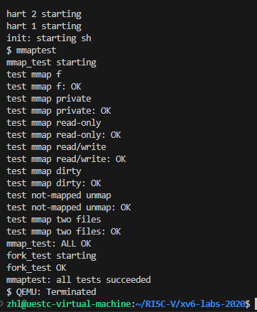

# lab10.mmap

## 实验相关

**mmap是一种内存映射文件的方法，即将一个文件或者其它对象映射到进程的地址空间，实现文件磁盘地址和进程虚拟地址空间中一段虚拟地址的一一对映关系。实现这样的映射关系后，进程就可以采用指针的方式读写操作这一段内存，而系统会自动回写脏页面到对应的文件磁盘上，即完成了对文件的操作而不必再调用read,write等系统调用函数。相反，内核空间对这段区域的修改也直接反映用户空间，从而可以实现不同进程间的文件共享。**

* **mmap函数是将文件地址映射到虚拟内存中，返回映射后的地址，同时记录该进程映射到的文件信息。**
* **munmap函数就是取消进程地址空间中，文件地址某一部分的映射。**

## 实现思路

**1.与之前的系统调用实验一样，在不同的文件中添加一些代码：**

* **在 user/user.h 中添加系统调用声明：**

```c
void* mmap(void *addr, int length, int prot, int flags, int fd, uint offset);
int munmap(void *addr, int length);
```

* **在 user/usys.pl 中添加 entry 入口函数：**

```c
entry("mmap");
entry("munmap");
```

* **在 Makefile 中添加编译声明：**

```c
$U/_zombie\
$U/_mmaptest\
```

* **在 kernel/syscall.h 中添加系统调用码：**

```c
#define SYS_mmap   22
#define SYS_munmap 23
```

* **在 kernel/syscall.c 中添加系统调用函数引用：**

```c
extern uint64 sys_mmap(void);
extern uint64 sys_munmap(void);
...
[SYS_mmap]    sys_mmap,
[SYS_munmap]  sys_munmap,
```

* **在 kernel/sysfile.c 中添加sys\_mmap和sys\_munmap函数的声明和实现。**

**2.根据传入的函数参数，构建一个 VMA 结构体数组，实验手册中，数组长度建议为16：**

**kernel/proc.h**

```c
#define VMASIZE 16
struct vma {
  int used;
  uint64 addr;
  int length;
  int prot;
  int flags;
  int fd;
  int offset;
  struct file *file;
};
struct proc {
...
struct vma vma[VMASIZE];     // vma of file system
}
```

**3.然后实现 mmap 函数，首先接收传来的参数，判断参数的合法性，然后遍历 VMA 数组，找到还没有使用的 vma，将参数信息添加进去。这里映射的虚拟地址，可以直接填写堆的最高地址，然后让堆继续生长。**

**kernel/sysfile.c**

```c
uint64
sys_mmap(void)
{
  uint64 addr;
  int length, prot, flags, fd, offset;
  struct file *file;
  struct proc *p = myproc();
  if(argaddr(0, &addr) || argint(1, &length) || argint(2, &prot) ||
    argint(3, &flags) || argfd(4, &fd, &file) || argint(5, &offset)) {
    return -1;
  }
  if(!file->writable && (prot & PROT_WRITE) && flags == MAP_SHARED)
    return -1;
  length = PGROUNDUP(length);
  if(p->sz > MAXVA - length)
    return -1;
  for(int i = 0; i < VMASIZE; i++) {
    if(p->vma[i].used == 0) {
      p->vma[i].used = 1;
      p->vma[i].addr = p->sz;
      p->vma[i].length = length;
      p->vma[i].prot = prot;
      p->vma[i].flags = flags;
      p->vma[i].fd = fd;
      p->vma[i].file = file;
      p->vma[i].offset = offset;
      filedup(file);
      p->sz += length;
      return p->vma[i].addr;
    }
  }
  return -1;
}
```

**4.与实验五很相似，由于是懒加载，在读取或写入相应的虚拟地址时，会存在地址未映射的情况。这时需要将物理地址上的数据读到虚拟地址中，然后重新进行读取或写入操作。**

```c
void
usertrap(void)
{
  ...
  else if((which_dev = devintr()) != 0){
    // ok
  } else if(r_scause() == 13 || r_scause() == 15) {
    uint64 va = r_stval();
    if(va >= p->sz || va > MAXVA || PGROUNDUP(va) == PGROUNDDOWN(p->trapframe->sp)) p->killed = 1;
    else {
      struct vma *vma = 0;
      for (int i = 0; i < VMASIZE; i++) {
        if (p->vma[i].used == 1 && va >= p->vma[i].addr && va < p->vma[i].addr + p->vma[i].length) {
          vma = &p->vma[i];
          break;
        }
      }
      if(vma) {
        va = PGROUNDDOWN(va);
        uint64 offset = va - vma->addr;
        uint64 mem = (uint64)kalloc();
        if(mem == 0) {
          p->killed = 1;
        } else {
          memset((void*)mem, 0, PGSIZE);
          ilock(vma->file->ip);
          readi(vma->file->ip, 0, mem, offset, PGSIZE);
          iunlock(vma->file->ip);
          int flag = PTE_U;
          if(vma->prot & PROT_READ) flag |= PTE_R;
          if(vma->prot & PROT_WRITE) flag |= PTE_W;
          if(vma->prot & PROT_EXEC) flag |= PTE_X;
          if(mappages(p->pagetable, va, PGSIZE, mem, flag) != 0) {
            kfree((void*)mem);
            p->killed = 1;
          }
        }
      }
    }
  } else {
    printf("usertrap(): unexpected scause %p pid=%d\n", r_scause(), p->pid);
    printf("            sepc=%p stval=%p\n", r_sepc(), r_stval());
    p->killed = 1;
  }
...
}
```

**这里需要注意，由于测试时会测试地址在栈空间之外等不合法的地方，因此产生读写中断时，需要首先判断地址是否合法。然后判断地址是否在某个文件映射的虚拟地址范围内，如果找到该文件，则读取磁盘，并将地址映射到产生中断的虚拟地址上。**

**此外，还需要注意，由于一些地址并没有进行映射，因此在 walk 的时候，遇到这些地址直接跳过即可：**

**kernel/vm.c**

```c
void
uvmunmap(pagetable_t pagetable, uint64 va, uint64 npages, int do_free)
{
...
    if((*pte & PTE_V) == 0)
      continue;
      //panic("uvmunmap: not mapped");
...
}
int
uvmcopy(pagetable_t old, pagetable_t new, uint64 sz)
{
...
    if((*pte & PTE_V) == 0)
      //panic("uvmcopy: page not present");
      continue;
...
}
```

**5.这部分的逻辑比较简单，主要是取消虚拟地址的映射关系，同时，设置进程 VMA 结构体相应的 vma 为未使用状态。这部分函数，实验中做了简化，只需要取消地址与传入地址相同的文件的映射即可。**

```c
uint64
sys_munmap(void)
{
  uint64 addr;
  int length;
  struct proc *p = myproc();
  struct vma *vma = 0;
  if(argaddr(0, &addr) || argint(1, &length))
    return -1;
  addr = PGROUNDDOWN(addr);
  length = PGROUNDUP(length);
  for(int i = 0; i < VMASIZE; i++) {
    if (addr >= p->vma[i].addr || addr < p->vma[i].addr + p->vma[i].length) {
      vma = &p->vma[i];
      break;
    }
  }
  if(vma == 0) return 0;
  if(vma->addr == addr) {
    vma->addr += length;
    vma->length -= length;
    if(vma->flags & MAP_SHARED)
      filewrite(vma->file, addr, length);
    uvmunmap(p->pagetable, addr, length/PGSIZE, 1);
    if(vma->length == 0) {
      fileclose(vma->file);
      vma->used = 0;
    }
  }
  return 0;
}
```

**6.最后，需要处理一些附带的问题： fork 和 exit 函数。在进程创建和退出时，需要复制和清空相应的文件映射：**

**kernel/proc.c**

```c
int
fork(void){
...
  np->state = RUNNABLE;
  for(int i = 0; i < VMASIZE; i++) {
    if(p->vma[i].used){
      memmove(&(np->vma[i]), &(p->vma[i]), sizeof(p->vma[i]));
      filedup(p->vma[i].file);
    }
  }
  release(&np->lock);
...
}

void
exit(int status){
...
  for(int i = 0; i < VMASIZE; i++) {
    if(p->vma[i].used) {
      if(p->vma[i].flags & MAP_SHARED)
        filewrite(p->vma[i].file, p->vma[i].addr, p->vma[i].length);
      fileclose(p->vma[i].file);
      uvmunmap(p->pagetable, p->vma[i].addr, p->vma[i].length/PGSIZE, 1);
      p->vma[i].used = 0;
    }
  }
  begin_op();
...
}
```

## 实现结果


