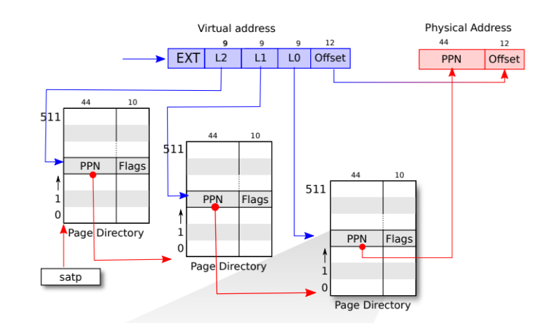
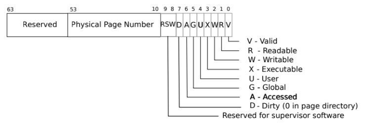
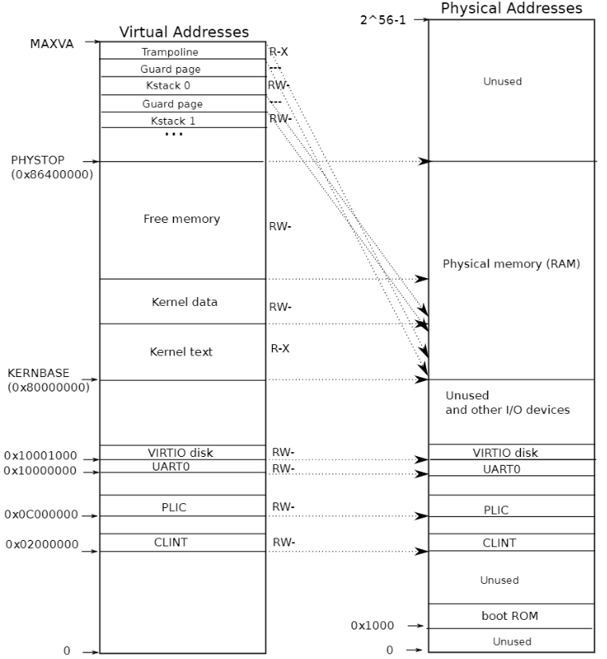
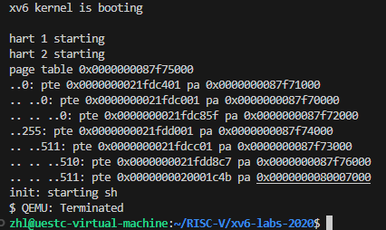

# 任务一、Print a page table

通过学习 xv6 系统页表，了解到操作系统利用多级页表来实现虚拟地址空间与真实物理地址空间的映射。为加深对页表的认识，实现一个函数，函数参数为页表地址，函数根据页表深度打印出各级页表及其对应真实物理地址。

## 虚拟内存相关

### 操作系统的隔离性

由于操作系统需要具有**隔离性**，即能够保证进程与进程之间互不影响。为了实现隔离性，操作系统为每个进程都分配了一段内存，且进程只能访问属于自己的这段内存，这样就可以保证每个进程之间相互隔离。如果一个进程崩溃了，其他进程还可以正常运行。虚拟地址空间是一种实现内存隔离的方式。

操作系统在读取可执行文件时，并不是直接将整个文件读到一块内存中，而是使用分段的方式，例如代码段、数据段等，将不同的段放到内存中不同的位置。在这个过程中，进程将每个段的段基地址进行存储。

取地址时，由于 cpu 是按照 “取出指令并进行执行” 的方式进行的，取出的地址是**逻辑地址**，即相对于段基地址的相对地址。段基地址（CS寄存器）加上偏移地址（IP寄存器）即为数据在内存中的地址。但这个地址也并不是真实的物理内存的地址，而是**虚拟地址**，需要通过进一步转换才能得到物理地址。

### 如何实现逻辑地址到物理地址呢？

答案是**页与页表**。由于在进程中的内存是连续的，但对应到物理内存不一定是连续的，一般而言，哪里有空闲的地方就将到那个位置上。这样就引入了**内存页**的概念。内存的大小并不是需要多少就分配多大的，由于进程需要的内存大小没有范围，有的大有的小，因此，如果安装进程所需的内存大小直接分配物理内存很容易出现大量的内存碎片。为此，将物理内存的大小按照内存页进行划分，通常一个内存页为 4096bytes 大小，12位比特。这样的话，操作系统就会按照进程所需的内存大小，分配给进程相应数量的内存页，可以有效的利用内存，减少内存的浪费。

上述通过计算得到虚拟地址还需要进一步映射到真实的物理地址上，这样的话就需要一个地址映射表，即**页表**。为了方便进行索引，页表的方式应该是线性的（线性页表的查找时间复杂度为O（1））。也就是说，**即使没有对应的物理内存，页表项也应该存在**。RISCV中的页表索引为 27 比特，也就是说，我们需要为每个进程维护一个 \$2^{27}\$ 大小的页表，这显然是不现实的。

为此，引入了**多级页表**，将 27 比特的索引划分为三级子页表，每个级别为 9 比特，代表页表的偏移量。这样的话，就有三级页表，每张表有 512 个表项。如果对应的子表不存在，则不需要创建这个子表，因此节省了大量的内存空间。多级页表的索引方式如下图所示：



由于每个页表有 512 个页表项，每个页表项有 64 位(8字节)大小，其中前10位为保留位，中间44位为存储下一个页表的地址，后10位是页表的标记位。标记位的作用如下图所示：



### 内核态页表与用户态页表

前面做系统调用相关的实验时讲到了，操作系统为了实现防御性和隔离性，使得用户不能直接操作硬件，而是通过操作系统来实现与底层硬件交互。用户在用户空间执行了需要与硬件交互的程序时，操作系统会通过提升执行权限的方式使操作系统进入内核态来获取执行权限。在进入内核态后，系统进入内核态，相应的，地址空间也切换到内核地址空间（内核态页表）。每个进程都有属于自己的用户态地址空间（页表），但内核态地址空间是所有进程公用的。

xv6操作系统的启动会从 0x80000000 这个地址开始。物理地址低于这个地址部分存放的是一些设备（如UART０），大于这个地址用来存放代码、数据、栈。这些其他 I/O 设备的地址由内核态页表使用直接映射的方式进行存储，内核态页表的虚拟地址与物理地址相同。仅有两个映射例外，一个是内核栈，另一个是 `trampoline` 页，这两部分的映射并不是直接映射。内核地址空间分布如下入所示：

## 实验思路

根据 RISC-V 手册知道，关于 xv6 操作系统虚拟地址空间的实现代码都在 vm.c 中，通过阅读该文件中的代码找到关于释放页表函数 `void freewalk(pagetable_t pagetable)`，函数接收根页表地址递归的释放各级页表代码如下：

```ｃ
// Recursively free page-table pages.
// All leaf mappings must already have been removed.
void
freewalk(pagetable_t pagetable)
{
  // there are 2^9 = 512 PTEs in a page table.
  //遍历当前level页表中的PTE
  for(int i = 0; i < 512; i++){
    pte_t pte = pagetable[i];
     // 查看flag是否被设置，若被设置，则为最低一层。只有在页表的最后一级，才可进行读、写、执行。
     // 如果不是最低一层，则继续往下走，直到最后一层开始回溯。
    if((pte & PTE_V) && (pte & (PTE_R|PTE_W|PTE_X)) == 0){
      // this PTE points to a lower-level page table.
      uint64 child = PTE2PA(pte);
       // 即从最后一级往上逐个释放
      freewalk((pagetable_t)child);
      pagetable[i] = 0;
    } else if(pte & PTE_V){
      panic("freewalk: leaf");
    }
  }
  kfree((void*)pagetable);
}

```

从代码实现可以看出此函数实现的功能是递归地去释放页表的各个page：

* 页表的数据结构是pagetable_t，实际上就是uint64 *，即一个指针，所以页表实际上是一个数组。
* 该函数首先有一个循环来遍历各级页表数组中的512个PTE。在循环中，判断当前PTE是否存在且有效。
* 如果满足条件，就获取该PTE对应的物理page(下一级PTE所在的page)，并将其作为参数递归调用当前的freewalk函数，直到走到叶子。最后将当前PTE置0。
* 如果不满足条件，就触发一个panic调用kfree释放内存。

根据 freewalk() 函数获悉页表的递归遍历，由此写出实现在 vm.c 中的 vmprint()函数，函数代码如下：

```c
void vmp(pagetable_t pagetable, uint64 level)
{
  for(int i = 0; i < 512; i++)
  {
    pte_t pte = pagetable[i];
    if(pte & PTE_V)
    {
	  for (int j = 0; j < level; ++j) {
        if (j == 0) printf("..");
        else printf(" ..");
      }
      uint64 child = PTE2PA(pte); // 通过pte映射下一级页表的物理地址
      //打印pte的编号、pte地址、pte对应的物理地址(下一级页表的物理地址)
      printf("%d: pte %p pa %p\n", i, pte, PTE2PA(pte));
      // 查看是否到了最后一级，如果没有则继续递归调用当前函数。
      if ((pte & (PTE_R | PTE_W | PTE_X)) == 0)
      {
        vmp((pagetable_t)child, level+1);
      }  
    }
  }
}

void vmprint(pagetable_t pagetable)//
{
  printf("page table %p\n", pagetable);
  vmp(pagetable, 1);
}

```

vmprint()函数只接收页表指针，由于需要递归地向深处遍历，因此需要实现一个`void vmp(pagetable\_t pagetable, uint64 level)`配合。

## 实现步骤

1.由于 vm.c 中各函数都在 defs.h 中，因此新添加的函数需要在 defs.h 中增加对应的声明

2.将前面实现的函数添加到 vm.c文件中

3.exec.c 切换进程时，判断该进程是否为第一个进程，若是第一个则打印页表。

## 实验结果


