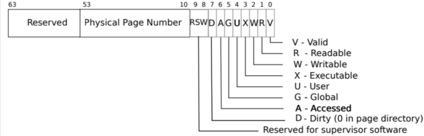
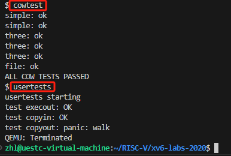

# Copy on write

## 实验相关

**实验需要实现内存的写时复制机制，写实复制机制是一种内存管理技术，旨在优化资源使用和提高性能。主要作用有以下几个方面：**

* 优化内存使用：当多个进程需要共享相同的数据时，写实复制可以显著减少内存的使用。具体来说，操作系统在初始时不会为每个进程分配独立的内存副本，而是让多个进程共享同一块内存。这在进程创建（如使用 `fork()` 系统调用）时尤为重要。只有当某个进程尝试修改共享数据时，操作系统才会为该进程创建一个独立的内存副本。
* 提高性能：由于初始时不需要复制整个内存区域，写实复制可以显著加快进程创建速度。例如，在 Unix 系统中，使用 `fork()` 创建新进程时，子进程最初与父进程共享相同的内存页面。只有在子进程或父进程尝试写入这些页面时，操作系统才会实际分配新页面。这减少了不必要的内存复制，提升了性能。
* **提高资源利用率：写实复制机制能够更高效地利用系统资源，尤其是内存资源。通过推迟实际的内存复制操作直到真正需要写入时，系统可以避免许多不必要的内存分配，从而提高内存利用率。**
* 实现内存保护写实复制还提供了一种内存保护的方式。操作系统可以将共享的内存页面标记为只读，防止进程意外修改共享数据。当进程试图写入这些页面时，会触发页面错误（page fault），然后操作系统会复制页面并更新页表，从而确保每个进程拥有自己的独立副本。
* 支持进程间通信：在某些情况下，写实复制机制可以被用于进程间的高效通信。例如，父进程和子进程可以共享一些只读数据，通过写实复制机制实现高效的数据共享和通信。

**拿 fork() 创建子进程场景为例，为了优化创建时资源利用率，可以在 fork 时，并不实际为其分配内存，而是让子进程和父进程共享相同的内存区域（父子进程的页表指向相同的物理内存地址）。但为了保证进程间的隔离性，父子进程不能同时对页表指向的物理内存进行修改操作，为了解决这个问题可以对页表进行标记，如设置共享且只读权限。当进程需要修改内存页时，会触发缺页中断，这时再拷贝一份内存页然后在拷贝的内存页映射到进程的页表，修改页表的执行权限后再重新执行修改操作。**

在这个过程中，需要为每个物理内存页保存一个指向该内存页的页表数量。当为 0 时，表示没有进程使用该内存页，内存页可以释放了；大于 1 时，每当有进程释放该内存页时，将对应的数值减 1。

## 实现思路

**需要 cow 处理的两个场景：**

* **一是用户进程写入内存，此时会触发 page fault 中断（15号中断是写入中断，只有这个时候会触发 cow，而13号中断是读页面，不会触发 cow）；**
* **二是直接在内核状态下写入对应的内存，此时不会触发 usertrap 函数，需要另做处理。**

**总的来说分为以下4个部分**

1. **实现标记COW页面**
2. **实现引用计数**
3. **fork() 会用到内存页面拷贝函数uvmcopy，修改uvmcopy实现延迟分配物理页面**
4. **用户态和内核态对内存的操作时，触发不同执行逻辑**

## 实现步骤

### 一、实现标记COW页面



**查看 RISC-V 的 PTE 标志位，可以看到 RSW 在第 8 - 10 位。标志位的定义在 kernel/riscv.h头文件中，在其中添加 COW标记**

```c
#define PTE_V (1L << 0) // valid
#define PTE_R (1L << 1)
#define PTE_W (1L << 2)
#define PTE_X (1L << 3)
#define PTE_U (1L << 4) // 1 -> user can access
#define PTE_COW (1L << 8) //添加的 COW 标记
```

### 二、实现引用计数

1.父进程在 `fork` 子进程时是按照代码顺序进行创建的，但是多个指向同一物理页面的进程释放可能是同时发生的，因此需要使用锁结构对引用计数数据结构进行保护，基于此在进程的内存开辟和释放相关文件中实现如下引用计数结构和方法：

```c
//引用计数结构体
struct pagerefcnt {
  struct spinlock lock;//锁
  uint8 refcount[PHYSTOP / PGSIZE];//xv6系统最多运行64个进程所以用uint8计数就足够了
} ref;

//引用计数方法
void incref(uint64 va) {
  acquire(&ref.lock);//先获取锁
  if(va < 0 || va > PHYSTOP) panic("wrong virtual address");
  ref.refcount[va / PGSIZE]++;//增加引用计数
  release(&ref.lock);//释放锁
}
```

**2.实现引用计数的结构体和方法后，将其应用到内存页面的释放和开辟上。这里修改**`kernel/kalloc.c`中的`kfree`函数，当引用计数减为0时才将页面放回空闲列表，否则直接返回。

```c
void
kfree(void *pa)
{
  //添加的内容
  acquire(&ref.lock);
  if(--ref.refcount[(uint64)pa / PGSIZE] > 0) {
    release(&ref.lock);
    return;
  }
  release(&ref.lock);
  //结束
  memset(pa, 1, PGSIZE);
  //......
}
```

**3.修改了内存页面释放函数，相对应的修改内存开辟函数，以对内存页面进行引用计数：**

```c
void *
kalloc(void)
{
  if(r)//开辟了内存
  {
    kmem.freelist = r->next;//从空闲内存链表中移除
    //添加
    acquire(&ref.lock);//获取锁
    ref.refcount[(uint64)r / PGSIZE] = 1;//初始化这个内存页面的引用计数 
    release(&ref.lock);//释放锁
    //结束
  }
  release(&kmem.lock);
}

```

**4.初始化锁，在操作系统启动时调用 kinit() 函数进行锁和内存空间的初始化，以下是新增初始化引用计数使用到的自旋锁：**

```c
void
kinit()
{
  initlock(&kmem.lock, "kmem");
  //添加的内容
  initlock(&ref.lock, "ref"); //初始化自旋锁
  //结束
  freerange(end, (void*)PHYSTOP);
}
```

**初始化时会调用**`freerange(end, (void*)PHYSTOP);`函数，该函数利用`kfree(p);`释放每一个内存页面给操作系统。所以在这里，每一个内存页面在调用`kfree(p);`之前的引用计数应该为 1。

```c
void
freerange(void *pa_start, void *pa_end)
{
  char *p;
  p = (char*)PGROUNDUP((uint64)pa_start);
  for(; p + PGSIZE <= (char*)pa_end; p += PGSIZE) {
    //添加
    ref.refcount[(uint64)p / PGSIZE] = 1; //这里设置为 1 再kfree就变成0了
    //结束
    kfree(p);
  }
}
```

### 三、修改uvmcopy

**前面讲到fork()子进程时，并不会实际拷贝父进程中的数据，而是将子进程映射到相同的物理页面上，因此需要修改fork时，调用的内存页面拷贝函数 uvmcopy()函数：**

```c
int
uvmcopy(pagetable_t old, pagetable_t new, uint64 sz)//fork时，old是父进程页表，new是子进程页表
{
  pte_t *pte;
  uint64 pa, i;
  uint flags;
  //char *mem;
  for(i = 0; i < sz; i += PGSIZE){//遍历一个页表内的所有页表项
    if((pte = walk(old, i, 0)) == 0)
      panic("uvmcopy: pte should exist");
    if((*pte & PTE_V) == 0)
      panic("uvmcopy: page not present");
    pa = PTE2PA(*pte);
    flags = PTE_FLAGS(*pte);
    //更新PTE、flag
    flags = (flags & ~PTE_W) | PTE_COW;
    *pte = (~(*pte ^ ~PTE_W)) | PTE_COW;
    // if((mem = kalloc()) == 0)  //取消实际的内存分配
    //   goto err;
    // memmove(mem, (char*)pa, PGSIZE);
    if(mappages(new, i, PGSIZE, (uint64)pa, flags) != 0){ //只进行内存映射
      //kfree(mem);
      goto err;
    }
    incref(pa);
  }
  return 0;
 err:
  uvmunmap(new, 0, i / PGSIZE, 1);
  return -1;
}
```

### 四、实现用户态和内核态发生page fault的处理逻辑

* **在用户态访问cow页面会由于缺页发生page fault，在usertrap中处理。**
* **内核缓存复制到用户空间(如read系统调用)会在copy\_out中写入cow页面引起page fault。**

**1.处理 usertrap ()**

```c
void
usertrap(void)
{
  //......
  } else if((which_dev = devintr()) != 0){
  // ok
  //添加page fault时的处理代码
  }else if(r_scause() == 15) {//15 说明发生了用户访问非独占页面
      uint64 va = r_stval(); //获取虚拟地址
      pte_t *pte = walk(p->pagetable, va, 0); //获取PTE
      if (!(PTE_FLAGS(*pte) & PTE_COW)) {
         p->killed = 1;
      }  else {
         va = PGROUNDDOWN(va); //虚拟地址向下取整
         uint64 ka = (uint64)kalloc(); //分配内存
         if(ka == 0) {//分配失败，杀死进程
           p->killed = 1;
         } else {
           uint64 flags = PTE_FLAGS(*pte);
           flags = flags & ~PTE_COW; //标记为非COW页面
           uint64 pa = walkaddr(p->pagetable, va); //找到物理地址
           memmove((void*)ka, (void *)pa, PGSIZE); //将物理地址上的内存复制到新开辟的内存
           uvmunmap(p->pagetable, va, 1, 1);//解除指向共享物理页面的映射
           mappages(p->pagetable, va, 1, ka, flags | PTE_W); //重新映射到刚刚开辟的物理页面，权限设置为可写
         }
      } 
  }
  //结束
  else {
    printf("usertrap(): unexpected scause %p pid=%d\n", r_scause(), p->pid);
    //......
}
```

**2.实现内核态下触发 **`page fault` 的处理逻辑，这里实现了 `copyout()` 中关于 page fault 的处理：

```c
int
copyout(pagetable_t pagetable, uint64 dstva, char *src, uint64 len)
{
  uint64 n, va0, pa0;
  if(dstva > MAXVA - len) return -1; //添加
  while(len > 0){
    va0 = PGROUNDDOWN(dstva);
    //添加
    pte_t *pte = walk(pagetable, va0, 0);
    if(pte == 0) return -1;
    if(!(PTE_FLAGS(*pte)&PTE_W)) {
      if(!(PTE_FLAGS(*pte)&PTE_COW)) {
        return -1;
      }
      uint64 va = va0;
      uint64 ka = (uint64)kalloc();
       if(ka == 0) {
         return -1;
       } else {
         uint64 flags = PTE_FLAGS(*pte);
         flags = flags & ~PTE_COW;
         uint64 pa = walkaddr(pagetable, va);
         memmove((void*)ka, (void *)pa, PGSIZE);
         uvmunmap(pagetable, va, 1, 1);
         mappages(pagetable, va, 1, ka, flags | PTE_W);
       }
    }
    //结束
    pa0 = walkaddr(pagetable, va0);
    //......
}
```

## 实现结果

**通过了**`cowtest`和`usertests`


