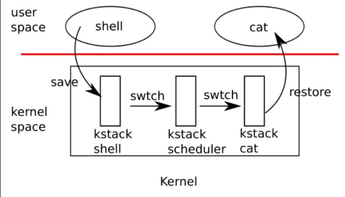
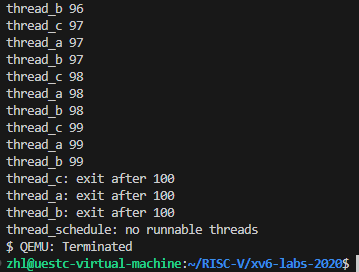
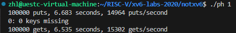
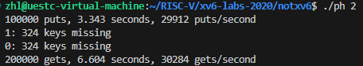
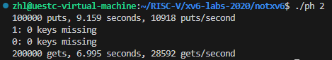
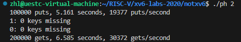
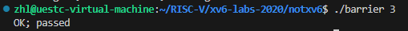

# thread

## 实验相关

**这个实验的主要内容是在 xv6 系统中实现用户态的线程（协程），包括线程的创建、调度和线程同步三个部分。**

**简单介绍以下线程调度**

* **首先是用户线程接收到了时钟中断，****强迫CPU从用户空间进程切换到内核**，同时在 trampoline 代码中，保存当前寄存器状态到 trapframe 中；
* **在 usertrap 处理中断时**，切换到了该进程对应的内核线程；
* 内核线程在内核中，先做一些操作，****然后调用 swtch 函数，保存用户进程对应的内核线程的寄存器至 context 对象**；
* **swtch 函数并不是直接从一个内核线程切换到另一个内核线程；而是先切换到当前 cpu 对应的调度器线程**，之后就在调度器线程的 context 下执行 schedulder 函数中；
* **schedulder 函数会再次调用 swtch 函数，切换到下一个内核线程中，由于该内核线程肯定也调用了 swtch 函数，所以之前的 swtch 函数会被恢复**，并返回到内核线程所对应进程的系统调用或者中断处理程序中。
* **当内核程序执行完成之后，****trapframe 中的用户寄存器会被恢复，完成线程调度**。

**课程中的示意图：**



## 任务一、Uthread

**实现一个用户态线程及其调度，这里的“线程”是完全用户态实现的，多个线程只能运行在一个 CPU 核心上，并且没有时钟中断来强制执行调度，需要线程自身主动 yield 释放 CPU。**

### 实现思路

**1.实现线程结构体**

```c
struct thread {
  char       stack[STACK_SIZE]; /* the thread's stack 线程栈*/
  int        state;             /* FREE, RUNNING, RUNNABLE 线程的三个状态*/
  struct context threadContext;       /* saved registers 用于线程切换时寄存器的保存和恢复*/
};
```

**2.实现线程切换函数的声明和定义**

```c
//声明
void thread_switch(struct context*, struct context*);
```

```c
/*实现*/
thread_switch:
    /* YOUR CODE HERE */
    sd ra, 0(a0)
    sd sp, 8(a0)
    sd s0, 16(a0)
    sd s1, 24(a0)
    sd s2, 32(a0)
    sd s3, 40(a0)
    sd s4, 48(a0)
    sd s5, 56(a0)
    sd s6, 64(a0)
    sd s7, 72(a0)
    sd s8, 80(a0)
    sd s9, 88(a0)
    sd s10, 96(a0)
    sd s11, 104(a0)

    ld ra, 0(a1)
    ld sp, 8(a1)
    ld s0, 16(a1)
    ld s1, 24(a1)
    ld s2, 32(a1)
    ld s3, 40(a1)
    ld s4, 48(a1)
    ld s5, 56(a1)
    ld s6, 64(a1)
    ld s7, 72(a1)
    ld s8, 80(a1)
    ld s9, 88(a1)
    ld s10, 96(a1)
    ld s11, 104(a1)

  
    ret    /* return to ra */
```

**3.线程创建函数的实现**

```c
void 
thread_create(void (*func)())
{
  struct thread *t;//线程结构体
  for (t = all_thread; t < all_thread + MAX_THREAD; t++) {
    if (t->state == FREE) break;
  }
  t->state = RUNNABLE;
  // YOUR CODE HERE
  t->threadContext.ra = (uint64)func;//修改ra保证跳转到func
  t->threadContext.sp = (uint64)t->stack + STACK_SIZE;//修改sp保证栈指针指向栈顶
}
```

**4.线程调度的实现**

```c
void 
thread_schedule(void)
{
  struct thread *t, *next_thread;//线程集合struct thread[MAX_THREAD]和current_thread是一个全局变量
  /* Find another runnable thread. */
  next_thread = 0;
  t = current_thread + 1;
  for(int i = 0; i < MAX_THREAD; i++){//遍历线程数组
    if(t >= all_thread + MAX_THREAD)
      t = all_thread;
    if(t->state == RUNNABLE) {//找到一个可执行线程就进入下一步
      next_thread = t;
      break;
    }
    t = t + 1;
  }

  if (next_thread == 0) {//如果没有可执行线程就退出
    printf("thread_schedule: no runnable threads\n");
    exit(-1);
  }

  if (current_thread != next_thread) {         /* 判断是否切换线程  */
    next_thread->state = RUNNING;
    t = current_thread;
    current_thread = next_thread;
    /* YOUR CODE HERE
     * Invoke thread_switch to switch from t to next_thread:
     * thread_switch(??, ??);
     */
    thread_switch(&t->threadContext, &next_thread->threadContext);
  } else
    next_thread = 0;
}
```

### 实现结果



**三个线程按照顺序打印 1-100，执行结束后退出。**

## 任务二、Using thread

**使用哈希表探索并行程序（带有线程和锁）。修改并编译 ph.c 文件，利用加锁操作，解决哈希表 race-condition 导致的数据丢失问题。**

**主要是，在加大锁还是小锁的问题。如果只加一个锁，锁的粒度很大，会导致丢失性能，结果还不如不加锁的单线程。因此需要将锁的粒度减小，为每个槽位（bucket）加一个锁。**

### 未加锁时

**		**单线程：



**		**多线程：



### 加锁后

**		**多线程：



### 分成多个bucket，对每个 bucket 进行加锁



**结果分析：**

* **单线程执行相对于未加锁多线程对比可以看出，未加锁多线程****增加数据动作**执行会出现竟态条件最终会导致数据丢失，读取数据动作的执行速度翻倍。说明了多线程并发执行在不发生竟态条件的情况下，能够提升执行速度，但未做好数据同步的话会发生数据错误。
* **多线程执行对比加锁后的多线程执行，虽然执行结果没有减少但加锁之后****增加数据动作执行**速度下降了，速度甚至比单线程下还要慢，这样实现的并发程序得不偿失。
* **将操作的临界资源分成多个 bucket 后，对每个 bucket 加小锁，这样降低了锁的粒度。执行后发现****增加数据动作执行**速度相对于多线程只加一个大锁执行速度近乎翻倍，这说明了降低锁的粒度在一定条件下能够提升程序的并发执行效率。

## 任务三、Barrier

**这个任务主要是使用条件变量实现线程同步，主要包括两个动作：一个线程等待"条件变量的条件成立"而挂起；另一个线程使"条件成立"（给出条件成立信号）。为了防止竞争，条件变量的使用总是和一个互斥锁结合在一起。这里是生产者消费者模式，如果还有线程没到达，就加入到队列中，等待唤起；如果最后一个线程到达了，就将轮数加一，然后唤醒所有等待这个条件变量的线程。**

**代码实现如下：**

```c
static void 
barrier()
{
  // YOUR CODE HERE
  //
  // Block until all threads have called barrier() and
  // then increment bstate.round.
  //
  pthread_mutex_lock(&bstate.barrier_mutex);
  if(++bstate.nthread == nthread) {
    bstate.nthread = 0;
    bstate.round++;
    pthread_cond_broadcast(&bstate.barrier_cond);
  } else {
    pthread_cond_wait(&bstate.barrier_cond, &bstate.barrier_mutex);
  }
  pthread_mutex_unlock(&bstate.barrier_mutex);
}
```

### 实现结果：


