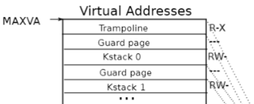
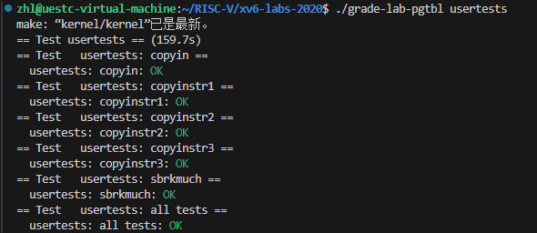
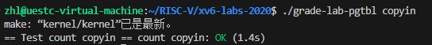

# 任务一、Print a page table

通过学习 xv6 系统页表，了解到操作系统利用多级页表来实现虚拟地址空间与真实物理地址空间的映射。为加深对页表的认识，实现一个函数，函数参数为页表地址，函数根据页表深度打印出各级页表及其对应真实物理地址。

## 虚拟内存相关

### 操作系统的隔离性

由于操作系统需要具有**隔离性**，即能够保证进程与进程之间互不影响。为了实现隔离性，操作系统为每个进程都分配了一段内存，且进程只能访问属于自己的这段内存，这样就可以保证每个进程之间相互隔离。如果一个进程崩溃了，其他进程还可以正常运行。虚拟地址空间是一种实现内存隔离的方式。

操作系统在读取可执行文件时，并不是直接将整个文件读到一块内存中，而是使用分段的方式，例如代码段、数据段等，将不同的段放到内存中不同的位置。在这个过程中，进程将每个段的段基地址进行存储。

取地址时，由于 cpu 是按照 “取出指令并进行执行” 的方式进行的，取出的地址是**逻辑地址**，即相对于段基地址的相对地址。段基地址（CS寄存器）加上偏移地址（IP寄存器）即为数据在内存中的地址。但这个地址也并不是真实的物理内存的地址，而是**虚拟地址**，需要通过进一步转换才能得到物理地址。

### 如何实现逻辑地址到物理地址呢？

答案是**页与页表**。由于在进程中的内存是连续的，但对应到物理内存不一定是连续的，一般而言，哪里有空闲的地方就将到那个位置上。这样就引入了**内存页**的概念。内存的大小并不是需要多少就分配多大的，由于进程需要的内存大小没有范围，有的大有的小，因此，如果安装进程所需的内存大小直接分配物理内存很容易出现大量的内存碎片。为此，将物理内存的大小按照内存页进行划分，通常一个内存页为 4096bytes 大小，12位比特。这样的话，操作系统就会按照进程所需的内存大小，分配给进程相应数量的内存页，可以有效的利用内存，减少内存的浪费。

上述通过计算得到虚拟地址还需要进一步映射到真实的物理地址上，这样的话就需要一个地址映射表，即**页表**。为了方便进行索引，页表的方式应该是线性的（线性页表的查找时间复杂度为O（1））。也就是说，**即使没有对应的物理内存，页表项也应该存在**。RISCV中的页表索引为 27 比特，也就是说，我们需要为每个进程维护一个 \$2^{27}\$ 大小的页表，这显然是不现实的。

为此，引入了**多级页表**，将 27 比特的索引划分为三级子页表，每个级别为 9 比特，代表页表的偏移量。这样的话，就有三级页表，每张表有 512 个表项。如果对应的子表不存在，则不需要创建这个子表，因此节省了大量的内存空间。多级页表的索引方式如下图所示：


由于每个页表有 512 个页表项，每个页表项有 64 位(8字节)大小，其中前10位为保留位，中间44位为存储下一个页表的地址，后10位是页表的标记位。标记位的作用如下图所示：


### 内核态页表与用户态页表

前面做系统调用相关的实验时讲到了，操作系统为了实现防御性和隔离性，使得用户不能直接操作硬件，而是通过操作系统来实现与底层硬件交互。用户在用户空间执行了需要与硬件交互的程序时，操作系统会通过提升执行权限的方式使操作系统进入内核态来获取执行权限。在进入内核态后，系统进入内核态，相应的，地址空间也切换到内核地址空间（内核态页表）。每个进程都有属于自己的用户态地址空间（页表），但内核态地址空间是所有进程公用的。

xv6操作系统的启动会从 0x80000000 这个地址开始。物理地址低于这个地址部分存放的是一些设备（如UART０），大于这个地址用来存放代码、数据、栈。这些其他 I/O 设备的地址由内核态页表使用直接映射的方式进行存储，内核态页表的虚拟地址与物理地址相同。仅有两个映射例外，一个是内核栈，另一个是 `trampoline` 页，这两部分的映射并不是直接映射。内核地址空间分布如下入所示：

## 实现思路

根据 RISC-V 手册知道，关于 xv6 操作系统虚拟地址空间的实现代码都在 vm.c 中，通过阅读该文件中的代码找到关于释放页表函数 `void freewalk(pagetable_t pagetable)`，函数接收根页表地址递归的释放各级页表代码如下：

```c
// Recursively free page-table pages.
// All leaf mappings must already have been removed.
void
freewalk(pagetable_t pagetable)
{
  // there are 2^9 = 512 PTEs in a page table.
  //遍历当前level页表中的PTE
  for(int i = 0; i < 512; i++){
    pte_t pte = pagetable[i];
     // 查看flag是否被设置，若被设置，则为最低一层。只有在页表的最后一级，才可进行读、写、执行。
     // 如果不是最低一层，则继续往下走，直到最后一层开始回溯。
    if((pte & PTE_V) && (pte & (PTE_R|PTE_W|PTE_X)) == 0){
      // this PTE points to a lower-level page table.
      uint64 child = PTE2PA(pte);
       // 即从最后一级往上逐个释放
      freewalk((pagetable_t)child);
      pagetable[i] = 0;
    } else if(pte & PTE_V){
      panic("freewalk: leaf");
    }
  }
  kfree((void*)pagetable);
}

```

从代码实现可以看出此函数实现的功能是递归地去释放页表的各个page：

* 页表的数据结构是pagetable_t，实际上就是uint64 *，即一个指针，所以页表实际上是一个数组。
* 该函数首先有一个循环来遍历各级页表数组中的512个PTE。在循环中，判断当前PTE是否存在且有效。
* 如果满足条件，就获取该PTE对应的物理page(下一级PTE所在的page)，并将其作为参数递归调用当前的freewalk函数，直到走到叶子。最后将当前PTE置0。
* 如果不满足条件，就触发一个panic调用kfree释放内存。

根据 freewalk() 函数获悉页表的递归遍历，由此写出实现在 vm.c 中的 vmprint()函数，函数代码如下：

```c
void vmp(pagetable_t pagetable, uint64 level)
{
  for(int i = 0; i < 512; i++)
  {
    pte_t pte = pagetable[i];
    if(pte & PTE_V)
    {
	  for (int j = 0; j < level; ++j) {
        if (j == 0) printf("..");
        else printf(" ..");
      }
      uint64 child = PTE2PA(pte); // 通过pte映射下一级页表的物理地址
      //打印pte的编号、pte地址、pte对应的物理地址(下一级页表的物理地址)
      printf("%d: pte %p pa %p\n", i, pte, PTE2PA(pte));
      // 查看是否到了最后一级，如果没有则继续递归调用当前函数。
      if ((pte & (PTE_R | PTE_W | PTE_X)) == 0)
      {
        vmp((pagetable_t)child, level+1);
      }  
    }
  }
}

void vmprint(pagetable_t pagetable)//
{
  printf("page table %p\n", pagetable);
  vmp(pagetable, 1);
}

```

vmprint()函数只接收页表指针，由于需要递归地向深处遍历，因此需要实现一个`void vmp(pagetable\_t pagetable, uint64 level)`配合。

## 实现步骤

1.由于 vm.c 中各函数都在 defs.h 中，因此新添加的函数需要在 defs.h 中增加对应的声明

2.将前面实现的函数添加到 vm.c文件中

3.exec.c 切换进程时，判断该进程是否为第一个进程，若是第一个则打印页表。

## 实现结果


# 任务二、A Kernel pagetable per process

Xv6有一个单独的用于在内核中执行程序时的内核页表。内核页表直接映射（恒等映射）到物理地址，也就是说内核虚拟地址`x`映射到物理地址仍然是`x`。Xv6还为每个进程的用户地址空间提供了一个单独的页表，只包含该进程用户内存的映射，从虚拟地址0开始。因为内核页表不包含这些映射，所以用户地址在内核中无效。因此，当内核需要使用在系统调用中传递的用户指针（例如，传递给`write()`的缓冲区指针）时，内核必须首先将指针转换为物理地址。(转换过程：获得用户空间逻辑地址->从进程控制块取出用户 pagetable ->根据逻辑地址从用户页表映射中找到对应物理地址)

本次任务就是让每个进程在内核中执行时都使用自己的内核页表副本。

## 实现思路

1.我们已经知道程序运行在用户态和内核态时使用的页表是不相同的。阅读 xv6 系统内核源码后发现在 kernel/proc.h 文件中有一个 `struct proc`结构体，查询xv6手册得知该结构体为进程控制块，内含由进程运行时记录状态的各种寄存器、用户态页表、进程执行时用来保存进程状态的陷阱帧`trapframe`等。所以，给*kernel/proc.h*里面的`struct proc`加上内核页表的字段，表示进程的内核页表。

```c
enum procstate { UNUSED, SLEEPING, RUNNABLE, RUNNING, ZOMBIE };

// Per-process state
struct proc {
  struct spinlock lock;

  // p->lock must be held when using these:
  enum procstate state;        // Process state
  struct proc *parent;         // Parent process
  void *chan;                  // If non-zero, sleeping on chan
  int killed;                  // If non-zero, have been killed
  int xstate;                  // Exit status to be returned to parent's wait
  int pid;                     // Process ID

  // these are private to the process, so p->lock need not be held.
  uint64 kstack;               // Virtual address of kernel stack
  uint64 sz;                   // Size of process memory (bytes)
  pagetable_t pagetable;       // User page table
  pagetable_t proc_kernel_pagetable //添加内核态页表
  struct trapframe *trapframe; // data page for trampoline.S
  struct context context;      // swtch() here to run process
  struct file *ofile[NOFILE];  // Open files
  struct inode *cwd;           // Current directory
  char name[16];               // Process name (debugging)
};

```

2.进程有了内核页表后还需要对其进行初始化，这部分功能的实现主要参考 kernel/vm.c 里的 kvminit 函数。该函数用于初始化内核页表，其中调用了 kvmmap函数，这个函数是给 kernel_pagetable 添加映射的，因此仿照它重新实现一个为用户页表添加映射的函数 ukvmap()。

```c
void
ukvmmap(pagetable_t kpagetable,uint64 va, uint64 pa, uint64 sz, int perm)
{
  if(mappages(kpagetable, va, sz, pa, perm) != 0)//映射pa物理地址到页表kpagetable的va逻辑地址上
    panic("ukvmmap");
}
```

再仿照 kvminit 初始化内核页表函数，实现用于在用户进程中初始化函数：

```c
pagetable_t ukvminit()
{
  pagetable_t kpagetable = (pagetable_t)kalloc();
  memset(kpagetable, 0, PGSIZE);

  ukvmmap(kpagetable, UART0, UART0, PGSIZE, PTE_R | PTE_W);
  ukvmmap(kpagetable, VIRTIO0, VIRTIO0, PGSIZE, PTE_R | PTE_W);
  ukvmmap(kpagetable, CLINT, CLINT, 0x10000, PTE_R | PTE_W);
  ukvmmap(kpagetable, PLIC, PLIC, 0x400000, PTE_R | PTE_W);
  ukvmmap(kpagetable, KERNBASE, KERNBASE, (uint64)etext-KERNBASE, PTE_R | PTE_X);
  ukvmmap(kpagetable, (uint64)etext, (uint64)etext, PHYSTOP-(uint64)etext, PTE_R | PTE_W);
  ukvmmap(kpagetable, TRAMPOLINE, (uint64)trampoline, PGSIZE, PTE_R | PTE_X);

  return kpagetable;
}
```

以上，已经完成了为进程创建内核页表的函数，接下来进程需要调用该函数，然后将创建的内核页表地址传入进程控制块中的 kernel_pagetable 中。阅读进程创建相关的函数 allocproc()，该函数的功能是：在进程表中查看各种进程的状态，找到一个状态为 UNUSED 进程，为该进程分配内存并初始化在内核中运行所需要的状态。函数如下：

```c
// Look in the process table for an UNUSED proc.
// If found, initialize state required to run in the kernel,
// and return with p->lock held.
// If there are no free procs, or a memory allocation fails, return 0.
static struct proc*
allocproc(void)
{
  struct proc *p;

  for(p = proc; p < &proc[NPROC]; p++) {
    acquire(&p->lock);
    if(p->state == UNUSED) {
      goto found;
    } else {
      release(&p->lock);
    }
  }
  return 0;

found:
  p->pid = allocpid();

  // Allocate a trapframe page.
  if((p->trapframe = (struct trapframe *)kalloc()) == 0){
    release(&p->lock);
    return 0;
  }

  // An empty user page table.
  p->pagetable = proc_pagetable(p);
  if(p->pagetable == 0){
    freeproc(p);
    release(&p->lock);
    return 0;
  }
  //开辟内核页表并完成映射
  p->proc_kernel_pagetable = ukvminit();
    if(p->proc_kernel_pagetable == 0){
	  freeproc(p);
	  release(&p->lock);
	  return 0;
    }

  // Set up new context to start executing at forkret,
  // which returns to user space.
  memset(&p->context, 0, sizeof(p->context));
  p->context.ra = (uint64)forkret;
  p->context.sp = p->kstack + PGSIZE;

  return p;
}

```

以上函数没有实现为进程创建内核页表，我们需要实现在进程创建时就创建好内核页表并完成进程内核页表的映射。

3.现在已经实现了为进程创建独立的内核页表了，但是多个进程之间要能够正确调度，还需要为每个进程页表分配一个内核栈。在原本 xv6 系统中，每个进程在内核中都预先分配了内核栈 Kstack，并将内核栈映射到内核的高地址空间中，并为了防止栈溢出导致影响其他进程的栈，xv6 系统在每个栈之间设置了无映射的 guard page。如下图所示：



内核栈的初始化函数 procinit()，该函数将内核栈映射到内核页表中，可参考代码如下：

```c
      char *pa = kalloc();//开辟的物理地址
      if(pa == 0)
        panic("kalloc");
      uint64 va = KSTACK((int) (p - proc));//内核栈逻辑地址
      kvmmap(va, (uint64)pa, PGSIZE, PTE_R | PTE_W);//将逻辑地址和物理地址映射
      p->kstack = va;
```

实现自己的内核栈分配程序，并将其放入 allocproc( ) 函数中。

```c
char *pa = kalloc();//开辟内核栈物理空间
if(pa == 0)
  panic("kalloc");
uint64 va = KSTACK((int) (p - proc));//内核栈逻辑地址
ukvmmap(p->proc_kernel_pagetable,va, (uint64)pa, PGSIZE, PTE_R | PTE_W);//完成映射
p->kstack = va;//内核栈指针，逻辑地址
```

4.经过以上步骤，独立的用户进程内核页表就创建完成了，内核栈也映射完成。接下来解决进程切换过程中，将对应进程的内核页表放入 satp 寄存器（这个寄存器用于用户态内核态切换、进程切换时页表的切换），管理进程调度的函数是 kernel/proc.c 中的 scheduler( )函数。我们对其进行如下修改：

```c
void
scheduler(void)
{
  struct proc *p;
  struct cpu *c = mycpu();
  
  c->proc = 0;
  for(;;){
    // Avoid deadlock by ensuring that devices can interrupt.
    intr_on();
  
    int found = 0;
    for(p = proc; p < &proc[NPROC]; p++) {
      acquire(&p->lock);
      if(p->state == RUNNABLE) {
        // Switch to chosen process.  It is the process's job
        // to release its lock and then reacquire it
        // before jumping back to us.
        p->state = RUNNING;
        c->proc = p;
        //在切换任务前，将用户内核页表替换到stap寄存器中
        w_satp(MAKE_SATP(p->proc_kernel_pagetable));
        // 清除快表缓存
        sfence_vma();
        swtch(&c->context, &p->context);   
        //该进程执行结束后，将SATP寄存器的值设置为全局内核页表地址
        kvminithart(); 
        c->proc = 0;
        found = 1;
      }
      release(&p->lock);
    }
#if !defined (LAB_FS)
    if(found == 0) {
      intr_on();
      asm volatile("wfi");
    }
#else
    ;
#endif
  }
}
```

5.最后进程执行结束后，需要释放对应的页表。进程释放相关的代码在 kernel/proc.c 中的 freeproc( ) 函数中。释放内核页表时需要注意，我们在内核页表中映射的内核栈是进程独有的，而其余部分如代码段、数据段和各种设备映射都是所有进程共享的。因此在页表释放时，内核栈既需要释放物理内存也需要解除映射，其余部分解除映射即可。

```c
void 
proc_freekernelpagetable(pagetable_t pagetable){
  for (int i = 0; i < 512; ++i) {
    pte_t pte = pagetable[i];
    if ((pte & PTE_V)) {
      pagetable[i] = 0;
      if ((pte & (PTE_R | PTE_W | PTE_X)) == 0) {
        uint64 child = PTE2PA(pte);
        proc_freekernelpagetable((pagetable_t)child);
      }
    } else if (pte & PTE_V) {
      panic("proc free kernelpagetable : leaf");
    }
  }
  kfree((void*)pagetable);
}

static void
freeproc(struct proc *p)
{
  if(p->trapframe)
    kfree((void*)p->trapframe);
  p->trapframe = 0;

// 删除内核栈
  if (p->kstack) {
    // 通过页表地址， kstack虚拟地址 找到最后一级的页表项
    pte_t* pte = walk(p->proc_kernel_pagetable, p->kstack, 0);
    if (pte == 0)
      panic("freeproc : kstack");
    // 删除页表项对应的物理地址
    kfree((void*)PTE2PA(*pte));
  }
  p->kstack = 0;

  if(p->pagetable)
    proc_freepagetable(p->pagetable, p->sz);
  p->pagetable = 0;

// 删除kernel pagetable，这里仅仅是解除了映射并未释放对应物理内存
  if (p->proc_kernel_pagetable) 
    proc_freekernelpagetable(p->proc_kernel_pagetable);

  p->sz = 0;
  p->pid = 0;
  p->parent = 0;
  p->name[0] = 0;
  p->chan = 0;
  p->killed = 0;
  p->xstate = 0;
  p->state = UNUSED;
}
```

最后修改 kvmpa 函数，该函数的作用是在进程进入内核态时将逻辑地址翻译成物理地址。由于我们为每个进程实现了内核页表的备份，所以进程在内核态时需要访问的是进程的内核逻辑地址。

```c
uint64
kvmpa(uint64 va)
{
  uint64 off = va % PGSIZE;
  pte_t *pte;
  uint64 pa;
  
  //注释掉，这里是访问原来的宏内核页表
  //pte = walk(kernel_pagetable, va, 0);
  
  //新添加的，修改成访问当前进程的内核页表
  struct proc *p = myproc();
  pte = walk(p->proc_kernel_pagetable, va, 0);

  if(pte == 0)
    panic("kvmpa");
  if((*pte & PTE_V) == 0)
    panic("kvmpa");
  pa = PTE2PA(*pte);
  return pa+off;
}

```

## 实现结果



## 任务三、Simplify copyin/copyinstr

任务三是衔接任务二，主要目的是将用户进程页表的所有内容(虚拟地址与物理地址的映射)都复制到内核页表中，这样的话，就完成了进程在内核态直接转换用户虚拟地址的方法。

这里简单介绍 copyin() 和 copyinstr() 这两个函数，copyin()函数读取用户指针指向的内存。通过将这些指针转换为物理地址来实现这一点，内核可以直接取消引用。它通过在软件中遍历进程用户页表来执行此转换。copyinstr() 实现原理类似，不过它主要用来拷贝字符串。

### 实现思路

1.需要将**vm.c**中`copyin`的内容替换为对`copyin_new`的调用，将**vm.c**中`copyinstr`的内容替换为对`copyinstr_new`的调用。其中，`copyin`和`copyinstr`的定义如下。

```c
// Copy from user to kernel.
// Copy len bytes to dst from virtual address srcva in a given page table.
// Return 0 on success, -1 on error.
int
copyin(pagetable_t pagetable, char *dst, uint64 srcva, uint64 len)
{
  uint64 n, va0, pa0;

  while(len > 0){
    va0 = PGROUNDDOWN(srcva);
    pa0 = walkaddr(pagetable, va0);
    if(pa0 == 0)
      return -1;
    n = PGSIZE - (srcva - va0);
    if(n > len)
      n = len;
    memmove(dst, (void *)(pa0 + (srcva - va0)), n);

    len -= n;
    dst += n;
    srcva = va0 + PGSIZE;
  }
  return 0;
}

// Copy a null-terminated string from user to kernel.
// Copy bytes to dst from virtual address srcva in a given page table,
// until a '\0', or max.
// Return 0 on success, -1 on error.
int
copyinstr(pagetable_t pagetable, char *dst, uint64 srcva, uint64 max)
{
  uint64 n, va0, pa0;
  int got_null = 0;

  while(got_null == 0 && max > 0){
    va0 = PGROUNDDOWN(srcva);
    pa0 = walkaddr(pagetable, va0);
    if(pa0 == 0)
      return -1;
    n = PGSIZE - (srcva - va0);
    if(n > max)
      n = max;

    char *p = (char *) (pa0 + (srcva - va0));
    while(n > 0){
      if(*p == '\0'){
        *dst = '\0';
        got_null = 1;
        break;
      } else {
        *dst = *p;
      }
      --n;
      --max;
      p++;
      dst++;
    }

    srcva = va0 + PGSIZE;
  }
  if(got_null){
    return 0;
  } else {
    return -1;
  }
}

```

这两个函数的原理和作用在前面已经介绍了。当前实验需要使用的 copyin_new 和 copyinstr_new已经实现好了，在使用时在原函数中调用对应的 new 函数即可。这两个 new 函数不再从进程控制块中查找用户态页表然后将逻辑地址转换成物理地址，而是直接从内核页表中的用户页表备份中获取物理地址。相当于内核页表中的用户页表备份也指向了用户页表指向的物理内存，因此，在内核页表中可以直接使用虚拟地址访问用户数据。

2.修改了进程内核页表后，关于进程页表相关的操作如，fork、exec、growproc等，需要加上对应的改变内核页表的功能，即将进程的用户页表的映射关系复制一份到内核页表中。复制操作可一参考 uvmcopy 函数，其作用是在 fork 子进程时，拷贝父进程的页表映射。

实现映射复制函数：

```c
int
uvmcopy_not_physical(pagetable_t old, pagetable_t new, uint64 begin, uint64 end)
{
  pte_t *pte, *newPte;
  uint64 pa, i;
  uint flags;

  for(i = PGROUNDDOWN(begin); i < end; i += PGSIZE){
    if((pte = walk(old, i, 0)) == 0)
      panic("uvmcopy_not_physical: pte should exist");
    if((newPte = walk(new, i, 1)) == 0)
      panic("uvmcopy_not_physical:page not present");
    pa = PTE2PA(*pte);
    flags = PTE_FLAGS(*pte) & (~PTE_U);

    *newPte = PA2PTE(pa) | flags;
  }
  return 0;
}

```

fork()修改：

```c
  // Copy user memory from parent to child.
  if(uvmcopy(p->pagetable, np->pagetable, p->sz) < 0 || uvmcopy_not_physical(np->pagetable, np->proc_kernel_pagetable, 0, p->sz) < 0){
    freeproc(np);
    release(&np->lock);
    return -1;
  }

```

exec()修改：

在映射之前要先检测程序大小是否超过`PLIC`，防止remap。同时，映射前要先清除[0，PLIC]中原本的内容，再将要执行的程序映射到[0，PLIC]中。

```c
 ------
  if((sz1 = uvmalloc(pagetable, sz, ph.vaddr + ph.memsz)) == 0)
     goto bad;

   // 添加检测，防止程序大小超过 PLIC
   if(sz1 >= PLIC)
     goto bad;

  ------
  
  // Commit to the user image.
  oldpagetable = p->pagetable;
  p->pagetable = pagetable;


//  清除内核页表中对程序内存的旧映射，然后重新建立映射。
  uvmunmap(p->proc_kernel_pagetable, 0, PGROUNDDOWN(p->sz)/PGSIZE, 0);
  uvmcopy_not_physical(pagetable, p->proc_kernel_pagetable, 0, sz);


  p->sz = sz;
  p->trapframe->epc = elf.entry;  // initial program counter = main
  p->trapframe->sp = sp; // initial stack pointer
  proc_freepagetable(oldpagetable, oldsz);
  ------
}

```

growproc()修改：

```c
if(PGROUNDUP(sz + n) >= PLIC) return -1;//添加防溢出函数
```

unminit()修改：

unminit 创建内核页表时也要包含第一个进程的用户页表

```c
 ------
uvminit(p->pagetable, initcode, sizeof(initcode));
  p->sz = PGSIZE;

//添加内容
  uvmcopy_not_physical(p->pagetable, p->proc_kernel_pagetable, 0, p->sz);
 
  // prepare for the very first "return" from kernel to user.
  p->trapframe->epc = 0;      // user program counter
  p->trapframe->sp = PGSIZE;  // user stack pointer

------

```

实现结果：


