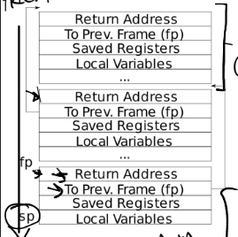
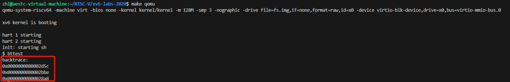
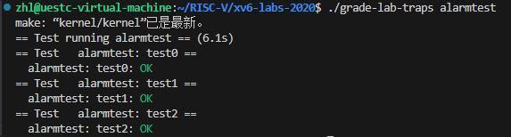

# 实验相关

**本次实验主要与 traps() 中断陷阱相关。完成实验需要掌握如何利用 trap 实现系统调用。**

### 中断和陷阱的定义

* **中断**：由硬件设备（如定时器、硬盘等）引发，通知 CPU 处理某些事件。
* **陷阱**：由软件引发的异常或系统调用，通知 CPU 处理某些特殊情况（如非法指令、系统调用等）。

### 中断和陷阱的处理流程

* **硬件引发中断或陷阱**：当中断或陷阱发生时，CPU 会切换到内核模式，并保存当前的 CPU 寄存器状态。
* **查找中断向量**：CPU 会根据中断或陷阱类型查找对应的中断向量（即中断描述符表 IDT 中的入口）。
* **调用中断或陷阱处理函数**：中断向量指向相应的处理函数，CPU 跳转到该处理函数开始执行。
* **保存上下文**：中断处理函数通常会首先保存当前执行的上下文，以便处理完中断后能恢复。
* **处理中断或陷阱**：执行具体的中断处理逻辑，如读取硬件设备状态、处理系统调用等。
* **恢复上下文**：处理完中断后，恢复之前保存的上下文。
* **返回原执行流程**：中断处理结束，返回到原先中断或陷阱发生时的执行点，继续执行。

**在 xv6 中，中断和陷阱机制通过硬件引发中断或陷阱，内核查找中断向量并调用相应的处理函数。中断处理函数会保存当前上下文，处理具体的中断或陷阱事件，然后恢复上下文并返回到原执行流程。这一机制确保了系统能及时响应硬件中断和软件异常，保持系统的稳定和高效运行。**

# 任务一、 Backtrace

**内核为每个进程分配了一段栈帧内存页，用于存放栈。函数调用就是在该位置处进行的。需要清楚的是：****fp为当前函数的栈顶指针，sp为栈指针。fp-8 存放返回地址，fp-16 存放原栈帧**（调用函数的fp）。因此，我们可以通过当前函数的栈顶指针 fp 来找到调用该函数的函数栈帧，然后递归地进行下去。直到到达当前页的开始地址。

!

### 实现思路

**1.**`backtrace()` 函数实现在 `kernel/printf.c` 文件中，因此先将函数声明添加到 `printf.c` 所包含的 defs.h 文件中。

**2.**`backtrace()` ，要想打印栈帧首先要获取栈帧指针 fp，这个指针一般保存在寄存器中，可以参考 `ricv.h`文件中相关代码。如获取机器模式的循环计数器函数：

```c
// machine-mode cycle counter
static inline uint64
r_time()
{
  uint64 x;
  asm volatile("csrr %0, time" : "=r" (x) );
  return x;
}
```

**模仿它实现：**

```c
// read the current frame pointer
static inline uint64
r_fp()
{
  uint64 x;
  asm volatile("mv %0, s0" : "=r"(x));
  return x;
}
```

**3.在**`printf.c`中实现 `backtrace()` 函数

```c
void backtrace(void) {
  uint64 fp = r_fp(), top = PGROUNDUP(fp);// 获取当前帧指针的值，将帧指针向上舍入到页面边界，这是为了确定栈的边界
  printf("backtrace:\n");打印调用栈的标题信息
  for(; fp < top; fp = *((uint64*)(fp-16))) {
    printf("%p\n", *((uint64*)(fp-8)));//循环遍历栈帧，打印每个栈帧中保存的返回地址
  }
}
```

### 实现结果



# 任务二、Alarm

**在本实验中，将向xv6添加一个功能，该功能会在进程使用CPU时定期提醒它。简单的说，将实现一种用户级中断/故障处理程序。最终应该实现一个新的sigalarm(interval, handler)系统调用。如果用户在用户态进行程序调用**`sigalarm(n, fn)`，那么在程序消耗每 n 个CPU时间`tick`之后，内核应该调用应用程序函数`fn`。当`fn`返回时，应用程序应该从中断的地方继续。在xv6中，tick是一个相当任意的时间单位，由硬件定时器产生中断的频率决定。如果应用程序调用sigalarm(0, 0)，内核应停止生成定期警报调用。

### 实验分为两个步骤：

#### 第一步实现：invoke handler唤醒处理程序

##### 实现思路：

**1.需要实现的函数首先会在用户态下执行，所以需要在用户态头文件****user/user.h**中进行函数声明：

```c
int sigalarm(int ticks, void (*handler)());
int sigreturn(void);
```

**2.前面的实验中介绍到，进行系统调用时，用户态程序需要对应的跳板函数才能进入内核态，因此在****user/usys.pl**添加相应的跳板函数入口：

```perl
entry("sigalarm");
entry("sigreturn");
```

**3.程序用户态接口处理完了，现在需要添加内核态相应系统调用号及其对应的系统调用函数：**

**更新****kernel/syscall.h**

```c
#define SYS_sigalarm 22 
#define SYS_sigreturn 23
```

**更新kernel/syscall.c。**

```c
extern uint64 sys_sigalarm(void); //添加
extern uint64 sys_sigreturn(void);//添加

static uint64 (*syscalls[])(void) = {
//......
[SYS_sigalarm] sys_sigalarm, //添加
[SYS_sigreturn] sys_sigreturn,//添加  
}
```

**4.将****警报间隔**和指向**警报处理函数**的指针存储在`proc`结构（进程控制块）中。中断发生后中断处理程序最终会通过该指针调用用户在用户态设置的回调函数；定义一个跟踪自上次调用警报处理程序以来已经过去了多少滴答的成员变量**ticks**。

```c
struct proc {
  //... ...     
  int interval;              // alarm interval time
  uint64 handler;            // alarm handle function
  uint64 ticks;                 // 设置 ticks，程序运行多少次 ticks 执行用户设置的回调函数
}
```

**5.在进程控制块中增加以上字段后，需要在进程创建函数**`allocproc()`中初始化`proc`字段。

```c
//......
p->context.sp = p->kstack + PGSIZE;
p->interval = 0;  //添加
p->handler = 0;   //添加
p->ticks = 0;     //添加
return 0;
//......
```

**6.查阅 xv6 手册知，发生时钟中断时会进入 **`usertrap`中进行处理。

* **有时钟中断发生，操作进程的**`tick`变量并判断，因此在`if (which_dev==2)`情况下进行处理。
* **如果tick没到达设定的间隔，则将tick++。**
* **如果tick达到设定的间隔，则将tick清零，同时转去相应的处理程序**`handler`。此处主要考虑如何调用处理函数`handler`。在`usertrap`中页表已经切换为内核页表，而`handler`仍然是用户页表的函数虚拟地址，因此不能直接调用。这里我们将`p->trapfram->epc`置为`p->handler`，这样在返回到用户空间时，程序计数器为`handler`定时函数的地址，便达到了执行定时函数的目的。(这里做的其实就是在内核态进行赋值，返回到用户态再执行。)

**在 usertrap() 函数中进行以下修改：**

```c
//......
// give up the CPU if this is a timer interrupt.
if(which_dev == 2){//发生了时钟中断
//添加
  if(p->interval)//已经设置了中断间隔
  {
    if(p->ticks == p->interval)//当滴答 ticks 到了预设的中断间隔时，初始化 ticks，设置epc以执行用户设置的回调函数
    {
      p->ticks = 0;
      p->trapframe->epc = p->handler;
    }//如果还没到 interval 则 ticks++ 计数
    p->ticks++;
//添加
  }
  yield();
}
```

**7.最后实现对应的系统调用，用户在用户态调用**`sigalarm`，跳转到内核执行`sys_sigalarm`。执行完毕之后，进程控制块中 interval、ticks、handler等被设置成用户输入的值。此后当一定时间过后ticks==interval，执行用户设置的回调函数。

```c
uint64 sys_sigalarm(void)
{
  int interval;
  uint64 handler;
  struct proc * p;
  // sigalarm的第一个参数为ticks，第二个参数为void(*handler)()
  if(argint(0, &interval) < 0 || argaddr(1, &handler) < 0 || interval < 0) {
    return -1;
  }
  p = myproc();
  p->interval = interval;
  p->handler = handler;
  p->ticks = 0;
  return 0;
}
```

### 第二步实现：resume interrupted code恢复中断发生时的代码执行

**第一步实现了用户设置一定间隔时间后执行用户指定回调函数功能。回调函数执行完毕后程序还需要返回到发生时的代码。现在需要实现的功能就是让程序执行完回调函数之后继续执行发生中断时的代码。**

##### 实现思路：

**1.首先梳理系统调用整体流程、调用时程序状态保存、调用前后寄存器值得变化**

* **首先会调用系统调用**`sys_sigalarm`。在调用之前，把所有的寄存器信息保存在了`trapframe`中。
* **然后进入内核中执行**`sys_sigalarm`函数。在执行的过程中只需要做一件事：为警报处理相关字段(如ticks、interval)进行赋值。
* **赋值完成后，该**`sys_sigalarm`系统调用就完成了。`trapframe`中保存的寄存器的值恢复，然后返回到用户态。(此时的trapframe没有保存的必要)
* **在用户态中，每经历一次时钟中断(在**`trap.c`中处理)就去对比ticks是否达到了规定的interval。如果达到了规定的`interval`，将返回地址(epc)更改为`handler`函数，返回用户态后便开始执行handler函数。
* **执行完**`handler`后，我们希望返回到调用`handler`前的状态。然而调用`handler`之前，返回地址`epc`已经被覆盖了。同时，执行`handler`后寄存器状态也会发生变化。
* **因此，需要在**`handler`覆盖掉`epc`之前需要保存好相应的寄存器状态。
  **如何保存和恢复相应寄存器的值**：
* `sigalarm(interval, handler)`和`sigreturn()`两个函数是配合使用的，在`handler`函数返回前会调用`sigreturn()`。
* **可以在**`struct proc`中保存一个`trapframe`的副本，在覆盖`epc`之前先保存副本，然后在`sys_sigreturn()`中将副本还原到`p->trapframe`中，从而在`sigreturn`系统调用结束后恢复用户寄存器状态时，能够将执行定时函数前的寄存器状态进行恢复。** **

**2.按照实现思路，在proc结构体中添加一个指向trapframe副本的指针。**

```c
struct proc {
    int interval;              // alarm interval time
    uint64 handler;            // alarm handle function
    uint64 ticks;                 // how many ticks have passed since the last call
    struct trapframe* trapframecopy; //添加
}
```

**3.在****kernel/trap.c**的`usertrap`中覆盖`p->trapframe->epc`**前**将trapframe的副本进行保存。同时，将之前调用`handler`后执行的`ticks = 0`删除，以实现防止`handler`重入。

```c
// give up the CPU if this is a timer interrupt.
if(which_dev == 2){
  if(p->interval)
  {
    if(p->ticks == p->interval)
    {
        p->trapframecopy = p->trapframe + 512;  
        memmove(p->trapframecopy,p->trapframe,sizeof(struct trapframe));    // 复制trapframe
        p->trapframe->epc = (uint64)p->handler;
    }
    p->ticks++;
  }
```

**4.在**`sys_sigreturn`中将`trapframecopy`拷贝到原`trapframe`中。恢复后将`trapframecopy`置零，表示当前没有副本。同时在拷贝`trapframecopy`前做了一个地址判断，是为了防止用户程序未调用`sigalarm`便使用了该系统调用。此时没有`trapframecopy`是无效的，可以避免错误拷贝。

```c
uint64 sys_sigreturn(void) {
    struct proc* p = myproc();
    // trapframecopy must have the copy of trapframe
    if(p->trapframecopy != p->trapframe + 512) {
        return -1;
    }
    memmove(p->trapframe, p->trapframecopy, sizeof(struct trapframe));   // 利用副本恢复第一次中断时的陷阱帧
    p->ticks = 0;     // 防止重入
    p->trapframecopy = 0;    // 置零
    return 0;
}
```

# 实现结果：


