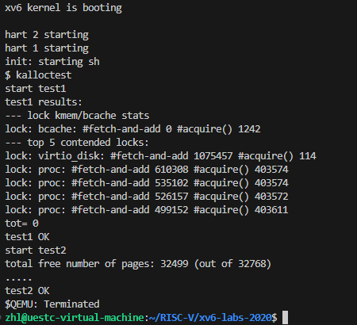

# locks

## 实验相关

**这次实验的目的是设计锁，降低多线程情况下对锁的竞争。总体思想是：降低锁的粒度，将一个大锁更换为一些粒度更小的锁，这样能大幅度降低锁的竞争。**

## 任务一、Memory allocator

**任务目的是解决多个进程对内存块的进程问题，原有内存结构是利用一个大锁锁住空闲内存链表的方式，根据实验指导书，将空闲内存链表进行拆分，为每个CPU分配一个空闲内存链表来降低竞争。**

### 实现思路

**1.将大的空闲内存链表分成CPU数量个小的链表，在 kernel/param.h文件中对量表结构进行修改：**

```
struct {
  struct spinlock lock;
  struct run *freelist;
} kmem[NCPU];//原来是单个链表，现在改成含有NCPU个链表的数组
```

**2.修改**`kinit`，为所有锁初始化以“kmem”开头的名称，该函数只会被一个CPU调用，`freerange`调用`kfree`将所有空闲内存挂在该CPU的空闲列表上

```
void
kinit()
{
  char lockname[8];
  for(int i = 0;i < NCPU; i++) {//对NCPU个kmem结构体初始化。
    snprintf(lockname, sizeof(lockname), "kmem_%d", i);
    initlock(&kmem[i].lock, lockname);
  }
  freerange(end, (void*)PHYSTOP);
}
```

**3.kfree函数的作用是释放物理内存并将其放回空闲内存链表，这里需要修改**`kfree`。注意：使用`cpuid()`和它返回的结果时必须关中断。

```
void
kfree(void *pa)
{
  struct run *r;
  if(((uint64)pa % PGSIZE) != 0 || (char*)pa < end || (uint64)pa >= PHYSTOP)
    panic("kfree");

  // Fill with junk to catch dangling refs.
  memset(pa, 1, PGSIZE);
  r = (struct run*)pa;

  push_off();  // 关中断
  int id = cpuid();//获取CPU号，用于确定回收的空间放回哪个空闲内存链表
  acquire(&kmem[id].lock);//对临界资源操作加锁
  r->next = kmem[id].freelist;//头插
  kmem[id].freelist = r;//移动链表头
  release(&kmem[id].lock);//释放锁
  pop_off();  //开中断
}
```

**4.kalloc 函数的作用是从空闲内存链表中取出内存，在本次任务中还需要实现在当前CPU没有空闲内存时从其他CPU空闲内存链表中偷取内存：**

```
void *
kalloc(void)
{
  struct run *r;
  push_off();// 关中断
  int id = cpuid();//获取CPU号，用于确定回收的空间放回哪个空闲内存链表
  acquire(&kmem[id].lock);//对临界资源操作加锁
  r = kmem[id].freelist;//取出空闲内存链表
  if(r)//如果有空闲内存
    kmem[id].freelist = r->next;//取出空闲内存块
  else {
    int antid;  // another id
    // 遍历所有CPU的空闲列表
    for(antid = 0; antid < NCPU; ++antid) {
      if(antid == id)//跳过本CPU对应空闲内存链表
        continue;
      acquire(&kmem[antid].lock);//获取锁
      r = kmem[antid].freelist;//取出空闲内存链表
      if(r) {//如果拿到空闲内存
        kmem[antid].freelist = r->next;
        release(&kmem[antid].lock);
        break;
      }
      release(&kmem[antid].lock);
    }
  }
  release(&kmem[id].lock);
  pop_off();  //开中断

  if(r)
    memset((char*)r, 5, PGSIZE); // fill with junk
  return (void*)r;
}
```

### 实现结果



## 任务二、Buffer cache

**多个进程同时使用文件系统的时候，bcache.lock 上会发生严重的锁竞争。****bcache.lock** 锁用于保护磁盘区块缓存，在原本的设计中，由于该锁的存在，多个进程不能同时操作（申请、释放）磁盘缓存。这个实验的目的是将缓冲区的分配与回收并行化以提高效率

### 实现思路

**1.定义哈希桶结构，并在**`bcache`中删除全局缓冲区链表，改为使用素数个散列桶

```
#define NBUCKET 13
#define HASH(id) (id % NBUCKET)

struct hashbuf {
  struct buf head;       // 头节点
  struct spinlock lock;  // 锁
};

struct {
  struct buf buf[NBUF];
  struct hashbuf buckets[NBUCKET];  // 增加散列桶
} bcache;
```

2. **在**`binit`中，（1）初始化散列桶的锁，（2）将所有散列桶的`head->prev`、`head->next`都指向自身表示为空，（3）将所有的缓冲区挂载到`buckets[0]`桶上，代码如下

```
void
binit(void) {
  struct buf* b;
  char lockname[16];

  for(int i = 0; i < NBUCKET; ++i) {
    // 初始化散列桶的自旋锁
    snprintf(lockname, sizeof(lockname), "bcache_%d", i);
    initlock(&bcache.buckets[i].lock, lockname);

    // 初始化散列桶的头节点
    bcache.buckets[i].head.prev = &bcache.buckets[i].head;
    bcache.buckets[i].head.next = &bcache.buckets[i].head;
  }

  // Create linked list of buffers
  for(b = bcache.buf; b < bcache.buf + NBUF; b++) {
    // 利用头插法初始化缓冲区列表,全部放到散列桶0上
    b->next = bcache.buckets[0].head.next;
    b->prev = &bcache.buckets[0].head;
    initsleeplock(&b->lock, "buffer");
    bcache.buckets[0].head.next->prev = b;
    bcache.buckets[0].head.next = b;
  }
}
```

3. **在**`buf.h`中增加新字段`timestamp`，这里来理解一下这个字段的用途：在原始方案中，每次`brelse`都将被释放的缓冲区挂载到链表头，表民这个缓冲区最近刚刚被使用过，在`bget`中分配时从链表尾向前查找，这样符合条件的第一个就是最久未使用的。而在提示中建议使用时间戳作为`LRU`判定的法则，这样我们就无需在`brelse`中进行头插法更改结点位置

```
struct buf {
  ...
  uint timestamp;  // 时间戳
};
```

4. **更改**`brelse`，不再获取全局锁

```
void
brelse(struct buf* b) {
  if(!holdingsleep(&b->lock))
    panic("brelse");

  int bid = HASH(b->blockno);

  releasesleep(&b->lock);

  acquire(&bcache.buckets[bid].lock);
  b->refcnt--;

  // 更新时间戳
  // 由于LRU改为使用时间戳判定，不再需要头插法
  acquire(&tickslock);
  b->timestamp = ticks;
  release(&tickslock);

  release(&bcache.buckets[bid].lock);
}
```

5. **更改**`bget`，当没有找到指定的缓冲区时进行分配，分配方式是优先从当前列表遍历，找到一个没有引用且`timestamp`最小的缓冲区，如果没有就申请下一个桶的锁，并遍历该桶，找到后将该缓冲区从原来的桶移动到当前桶中，最多将所有桶都遍历完。在代码中要注意锁的释放

```
static struct buf*
bget(uint dev, uint blockno) {
  struct buf* b;

  int bid = HASH(blockno);
  acquire(&bcache.buckets[bid].lock);

  // Is the block already cached?
  for(b = bcache.buckets[bid].head.next; b != &bcache.buckets[bid].head; b = b->next) {
    if(b->dev == dev && b->blockno == blockno) {
      b->refcnt++;

      // 记录使用时间戳
      acquire(&tickslock);
      b->timestamp = ticks;
      release(&tickslock);

      release(&bcache.buckets[bid].lock);
      acquiresleep(&b->lock);
      return b;
    }
  }

  // Not cached.
  b = 0;
  struct buf* tmp;

  // Recycle the least recently used (LRU) unused buffer.
  // 从当前散列桶开始查找
  for(int i = bid, cycle = 0; cycle != NBUCKET; i = (i + 1) % NBUCKET) {
    ++cycle;
    // 如果遍历到当前散列桶，则不重新获取锁
    if(i != bid) {
      if(!holding(&bcache.buckets[i].lock))
        acquire(&bcache.buckets[i].lock);
      else
        continue;
    }

    for(tmp = bcache.buckets[i].head.next; tmp != &bcache.buckets[i].head; tmp = tmp->next)
      // 使用时间戳进行LRU算法，而不是根据结点在链表中的位置
      if(tmp->refcnt == 0 && (b == 0 || tmp->timestamp < b->timestamp))
        b = tmp;

    if(b) {
      // 如果是从其他散列桶窃取的，则将其以头插法插入到当前桶
      if(i != bid) {
        b->next->prev = b->prev;
        b->prev->next = b->next;
        release(&bcache.buckets[i].lock);

        b->next = bcache.buckets[bid].head.next;
        b->prev = &bcache.buckets[bid].head;
        bcache.buckets[bid].head.next->prev = b;
        bcache.buckets[bid].head.next = b;
      }

      b->dev = dev;
      b->blockno = blockno;
      b->valid = 0;
      b->refcnt = 1;

      acquire(&tickslock);
      b->timestamp = ticks;
      release(&tickslock);

      release(&bcache.buckets[bid].lock);
      acquiresleep(&b->lock);
      return b;
    } else {
      // 在当前散列桶中未找到，则直接释放锁
      if(i != bid)
        release(&bcache.buckets[i].lock);
    }
  }

  panic("bget: no buffers");
}
```

6. **最后将末尾的两个小函数也改一下**

```
void
bpin(struct buf* b) {
  int bid = HASH(b->blockno);
  acquire(&bcache.buckets[bid].lock);
  b->refcnt++;
  release(&bcache.buckets[bid].lock);
}

void
bunpin(struct buf* b) {
  int bid = HASH(b->blockno);
  acquire(&bcache.buckets[bid].lock);
  b->refcnt--;
  release(&bcache.buckets[bid].lock);
}
```

### 实现结果


